
  <b>ROS2: OpenRoboticsToolkit</b>   

## Introduction

* 此工程为导航算法需要的基础知识。[详细文档](https://ros2-tutorials.readthedocs.io/en/latest/#)

* 详细的视频讲解 [哔哩哔哩 bilibili](https://space.bilibili.com/478832908)

## Part I ROS2 rclcpp

<table style="width:100%">
  <tr>
    <th>
      

           
            ROS2 Topic
      

    </th>
        <th>

           
            ROS2 Service
        

    </th>
       <th>

           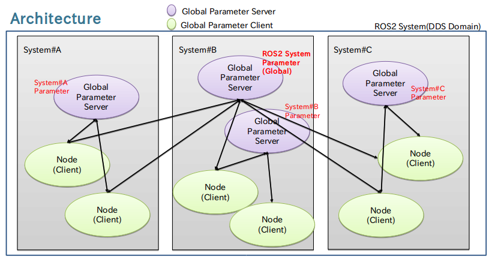
            ROS2 Parameters
        

    </th>
        <th>

           
            ROS2 Action
        

    </th>
  </tr>
    <th>
      

           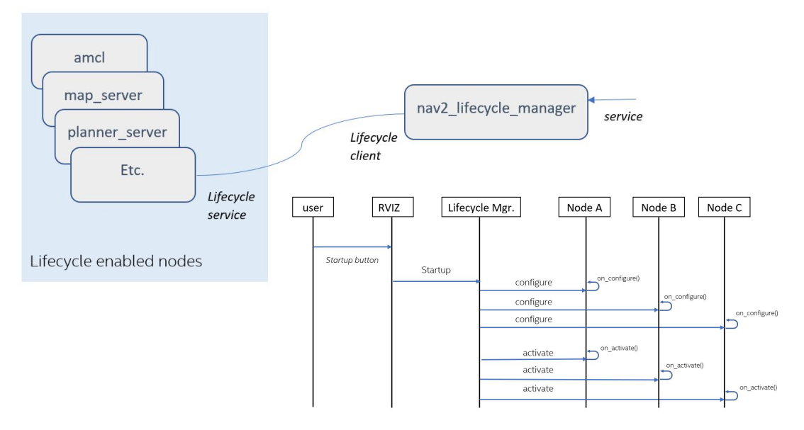
            ROS2 Lifecycle
      

    </th>
        <th>

           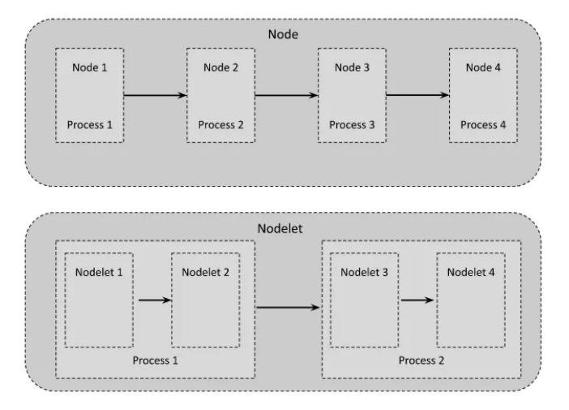
            ROS2 Composition
        

    </th>
       <th>

           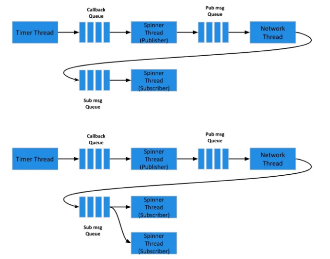
            ROS2 Timer
        

    </th>
        <th>

           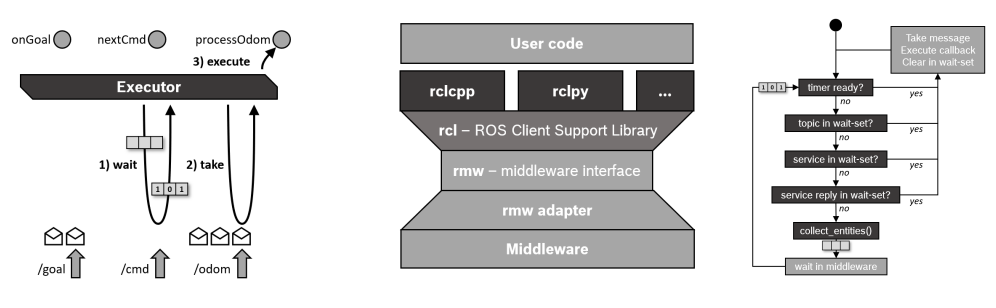
            ROS2 Executors
        

    </th>
</table>
* ROS2 Topic 
* ROS2 Service
* ROS2 Parameters
* ROS2 Action
* ROS2 Lifycycle
* ROS2 Composition
* ROS2 Timer
* ROS2 Executors

## Part II RVIZ2可视化

<table style="width:100%">
  <tr>
    <th>
      

           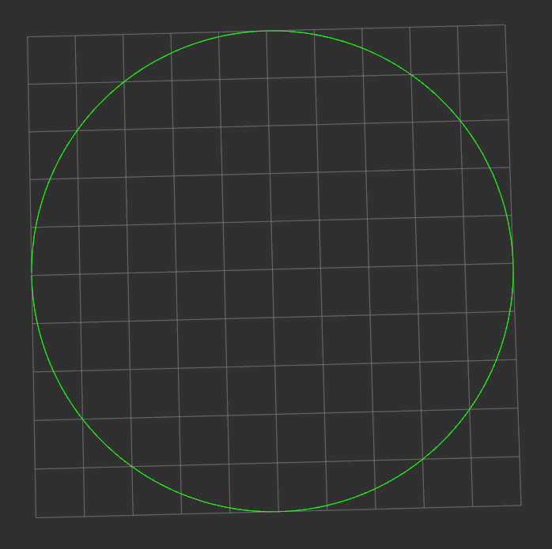
            RVIZ Path
      

    </th>
        <th>

           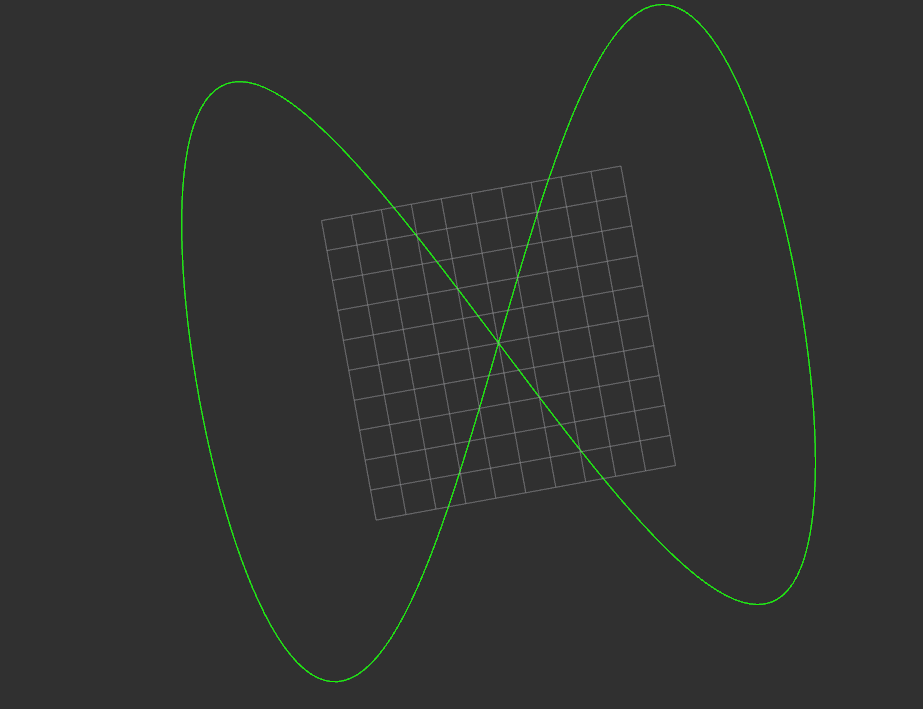
            RVIZ Trajectory
        

    </th>
       <th>

           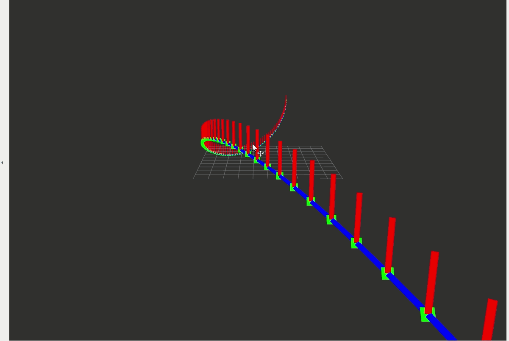
            RVIZ Marker: Point and Line
        

    </th>
     <th>
      

           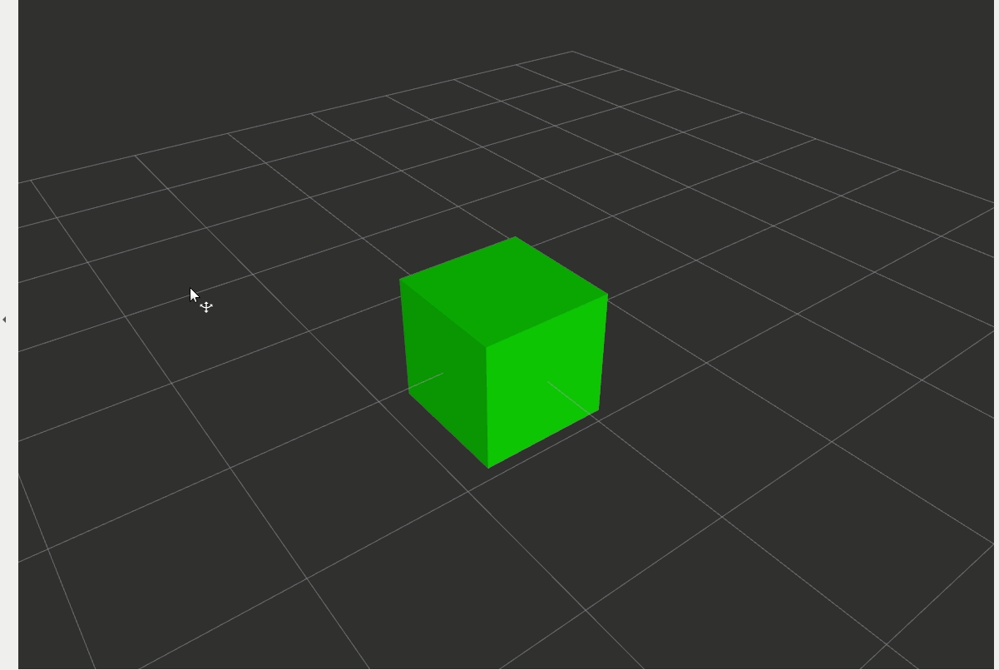
            RVIZ Marker: Cube shape
      

    </th>
  </tr>
   <tr>
     <th>

           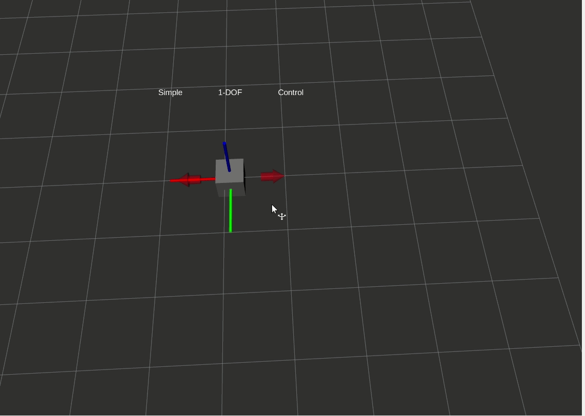
            RVIZ Marker: Simple marker
        

    </th>
       <th>

           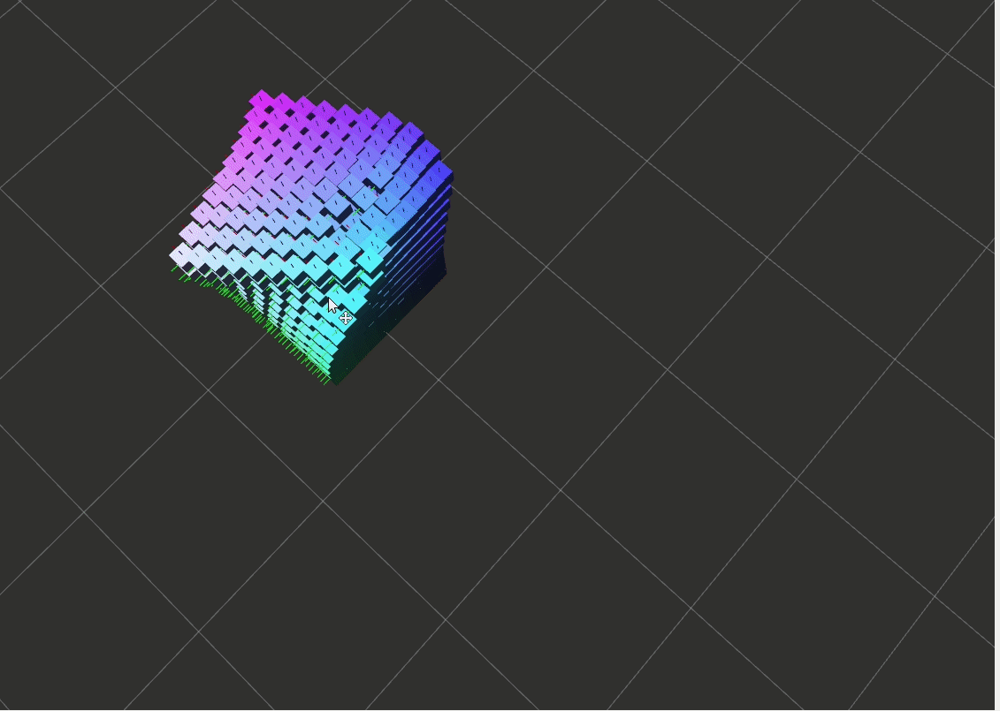
            RVIZ Marker: cube
        

    </th>
     <th>
      

           
            RVIZ Marker: ArrowMarker
      

    </th>
        <th>

           
            RVIZ Marker: CubeListMarker
        

    </th>
  </tr>
  <tr>
    <th>

           
            RVIZ Marker: CylinderMarker
        

    </th>
    <th>

           
            RVIZ Marker: LineListMarker
        

    </th>
    <th>

           
            RVIZ Marker: LineStripMarker
        

    </th> 
    <th>

           
            RVIZ Marker: PointsMarker
        

    </th>
  </tr>
  <tr>
    <th>

           
            RVIZ Marker: SphereListMarker
        

    </th>
    <th>

           
            RVIZ Marker: SphereMarker
        

    </th>
    <th>

           
            RVIZ Marker: mesh_resource_marker
        

    </th> 
    <th>

           
            RVIZ Marker: triangle_list_marker
        

    </th>
  </tr>
</table>

* RVIZ Path
* RVIZ Trajectory
* RVIZ Marker 

## Part III Gazebo仿真

<table style="width:100%">
  <tr>
    <th>
      

         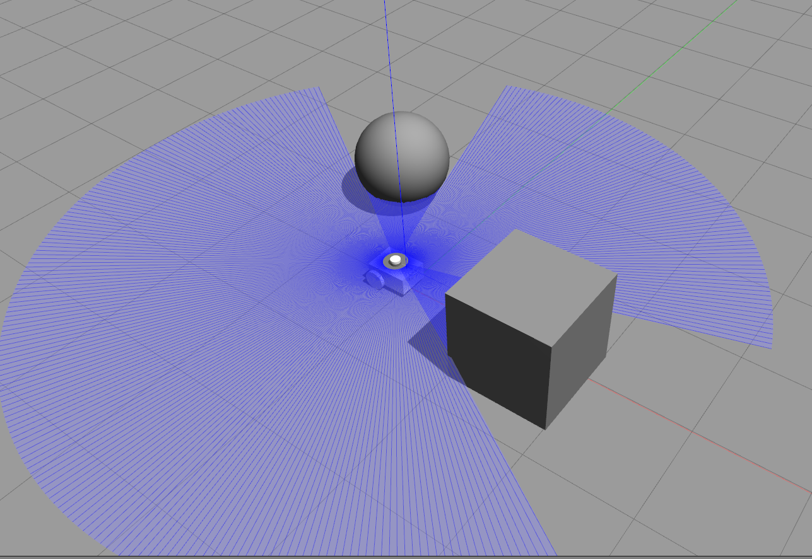
          Gazebo: sam_bot_description
      

    </th>
        <th>

           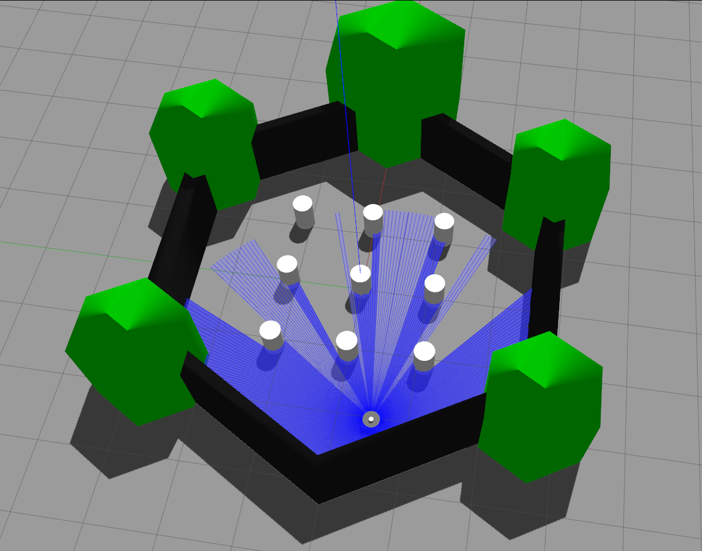
            Gazebo: turtlebot3
        

    </th>
  </tr>
</table>

* Gazebo Sensors
* Gazebo Differential Robot

## Part IV Behavior Tree

<table style="width:100%">
  <tr>
    <th>
      

          
            BT: Action
      

    </th>
        <th>

          
            BT: Control
        

    </th>
       <th>

           
            BT: Condition
        

    </th>
        <th>
       
            
             BT: Decorator    
           

      	</th>
    </tr>
</table>

* BT: Action
* BT: Control
* BT: Condition
* BT: Decorator

## Part V GridMap

<table style="width:100%">
  <tr>
    <th>
      

           
            GridMap: anymal_sdf_demo
      

    </th>
        <th>

           
            GridMap: ellipse_iterator_preview
        

    </th>
       <th>

           
            GridMap: filters_demo_preview
        

    </th>
     <th>
      

           
            GridMap: grid_cells_preview
      

    </th>
  </tr>
   <tr>
     <th>

           
            GridMap: grid_map_rviz_plugin_example
        

    </th>
       <th>

           
            GridMap: image_to_grid_map_demo_result
        

    </th>
     <th>
      

           
            GridMap: interpolationGaussWorld
      

    </th>
        <th>

           
            GridMap: interpolationSineWorld
        

    </th>
  </tr>
  <tr>
    <th>

           
            GridMap: line_iterator_preview
        

    </th>
    <th>

           
            GridMap: occupancy_grid_preview
        

    </th>
    <th>

           
            GridMap: opencv_demo_result
        

    </th> 
    <th>

           
            GridMap: point_cloud_preview
        

    </th>
  </tr>
  <tr>
    <th>

           
            GridMap: polygon_iterator_preview
        

    </th>
    <th>

           
            GridMap: spiral_iterator_preview
        

    </th>
    <th>

           
            GridMap: submap_iterator_preview
        

    </th> 
    <th>

           
            GridMap: vectors_preview
        

    </th>
  </tr>
</table>

* Gridmap: Iterators
* Gridmap: interpolation
* Gridmap: OpenCV
* Gridmap: ROS
* Gridmap: Filter
* Gridmap: RVIZ plugin
* Gridmap:  map_visualization
* Gridmap:  grid_map_costmap_2d

## Part VI 激光SLAM

* slam_toolbox

* cartographer

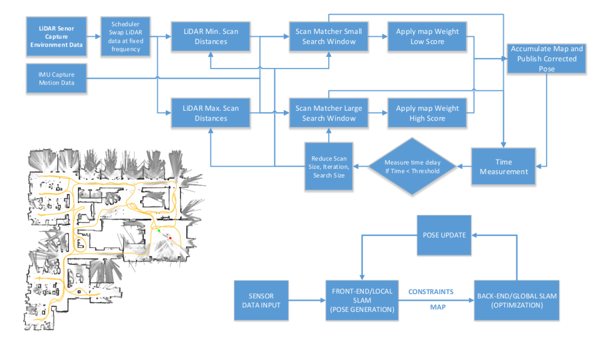

## Part VII Navigation2导航

* costmap2d 

  <table style="width:100%">
     <tr>
      <th>
        

            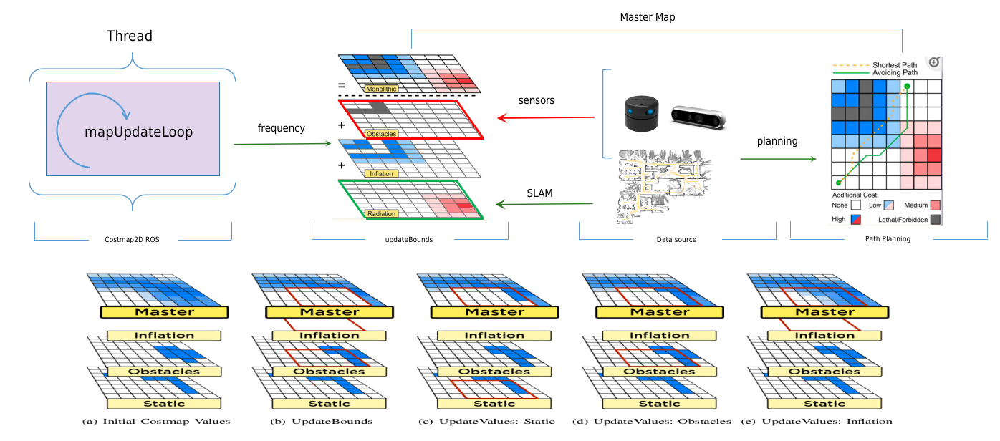
              Costmap2D: Framework
        

      </th>
          <th>

            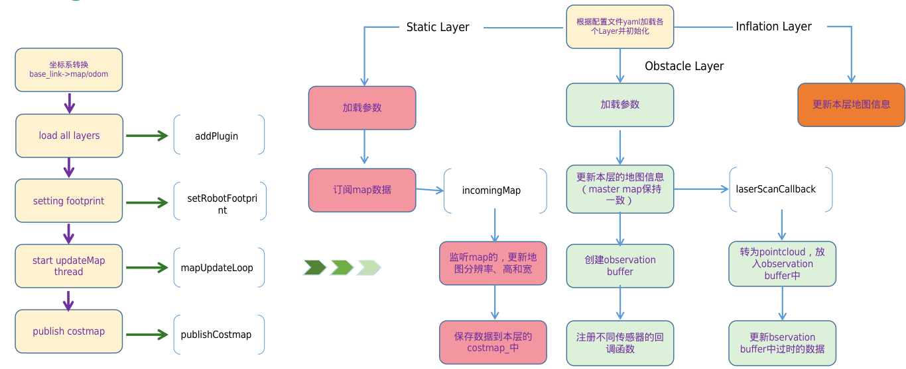
              Costmap2D: Initialization
          

      </th>
         <th>

             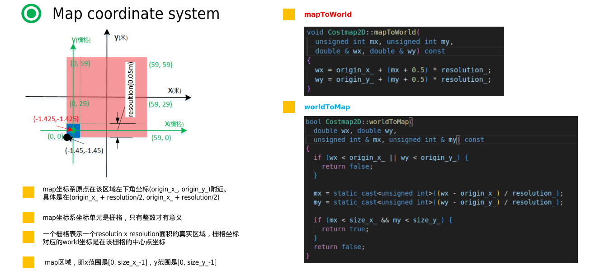
              Costmap2D: Map Frame 
          

      </th>
          <th>
       
              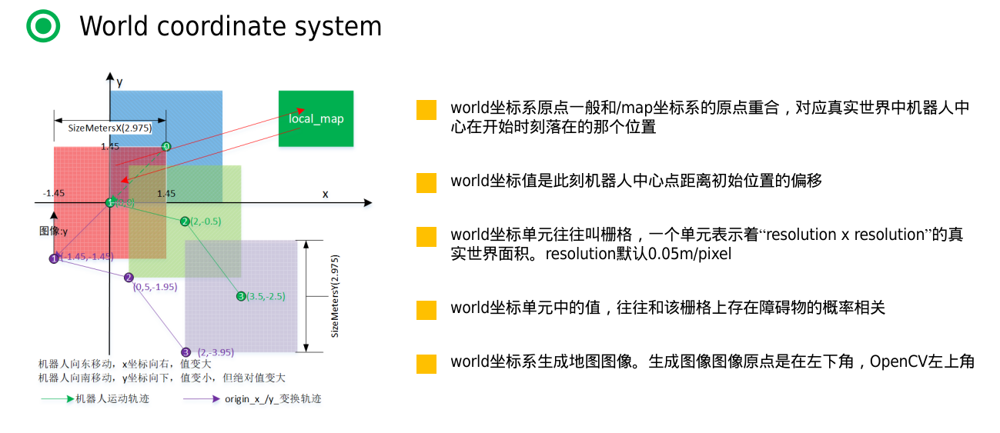
               Costmap2D: World Frame 
             

        	</th>
      </tr>
      <tr>
      <th>
        

            
              Costmap2D: Static Layer
        

      </th>
          <th>

            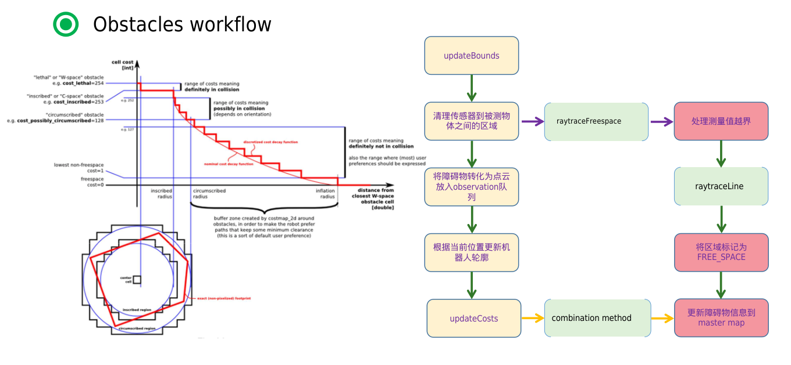
              Costmap2D: Obstacle Layer
          

      </th>
         <th>

             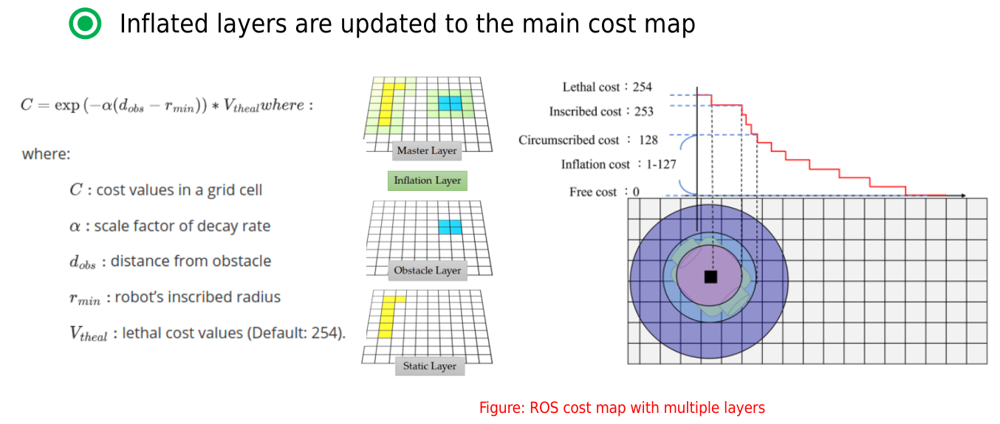
              Costmap2D: Inflated Layer
          

      </th>
          <th>
       
              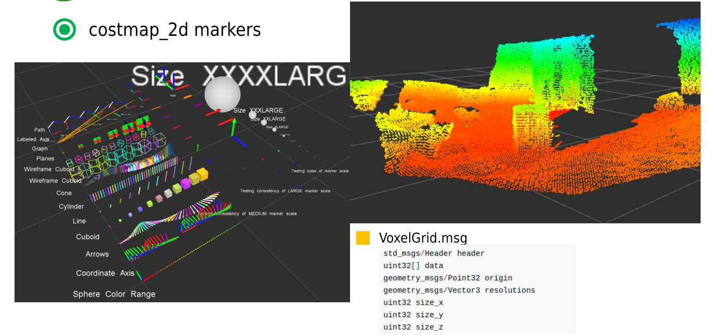
               Costmap2D: Visualization Tool
             

        	</th>
      </tr>
  </table>

* path planning

  |      Dijkstra Path Planning      | Dijkstra 最短路径算法TODO |  |
  | :------------------------------: | :-----------------------: | :----------------------------------------------------------: |
  |       **A* Path Planning**       |   **A*搜尋演算法TODO**    |                                                              |
  |   **Hybrid A*  Path Planning**   | **混合A*搜尋演算法TODO**  |                                                              |
  |     **Theta* Path Planning**     |         **TODO**          |                                                              |
  |     **dubins_path_planner**      |         **TODO**          |                                                              |
  |  **informed_rrt_star_planner**   |         **TODO**          |                                                              |
  |   **potential_field_planner**    |         **TODO**          |                                                              |
  |         **rrt_planner**          |         **TODO**          |                                                              |
  |   **voronoi_road_map_planner**   |         **TODO**          |                                                              |
  | **breadth_first_search_planner** |         **TODO**          |                                                              |
  |  **depth_first_search_planner**  |         **TODO**          |                                                              |

* path tracking

  |        DWA Controller        | TODO |      |
  | :--------------------------: | ---- | ---- |
  | **Pure  pursuit Controller** | TODO |      |
  | **Rotation shim controller** | TODO |      |
  |      **TEB Controller**      | TODO |      |
  |      **LQR Controller**      | TODO |      |
  |      **MPC Controller**      | TODO |      |

## QQ社区交流

* 躬身入局挺膺负责，方有成事之可冀
