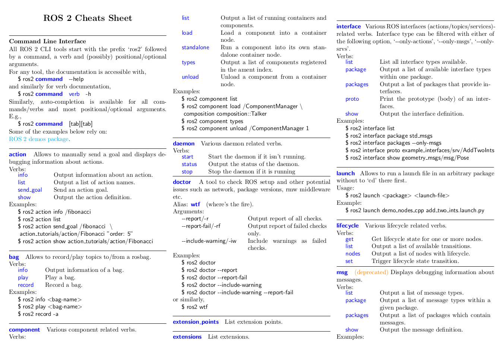

# ROS2-Action

<<<<<<< HEAD


# 1 

## 2

### 3


* lll
* iiiiiii


----


```

```


**yhidii** 

**jjjjj**


<font color='red'> kkkkkk </font>


```c++
if (!report_ok) {
    common::CyberdogJson::Add(json_response, "status", "kFail");
    common::CyberdogJson::Add(json_response, "result", false);
} else {
    common::CyberdogJson::Add(json_response, "status", "kSuccess");
    common::CyberdogJson::Add(json_response, "result", true);
}
```





=======
* author :  yuzhenyang
* e-mail: 
>>>>>>> e7534464fa00b7a86a527927d5d5db5505d0fefd
