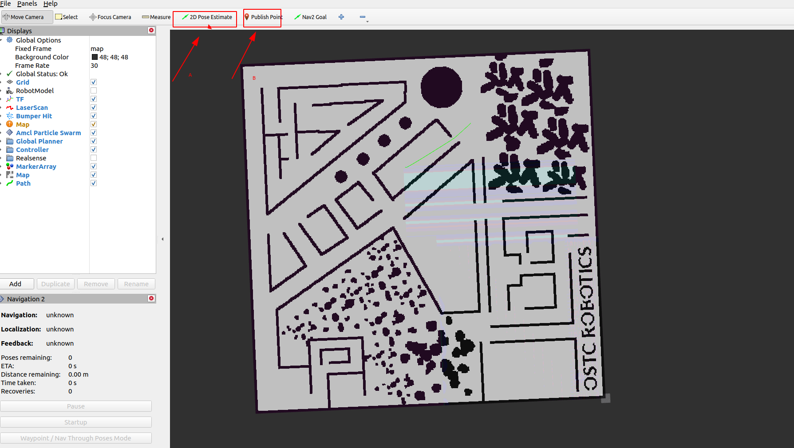
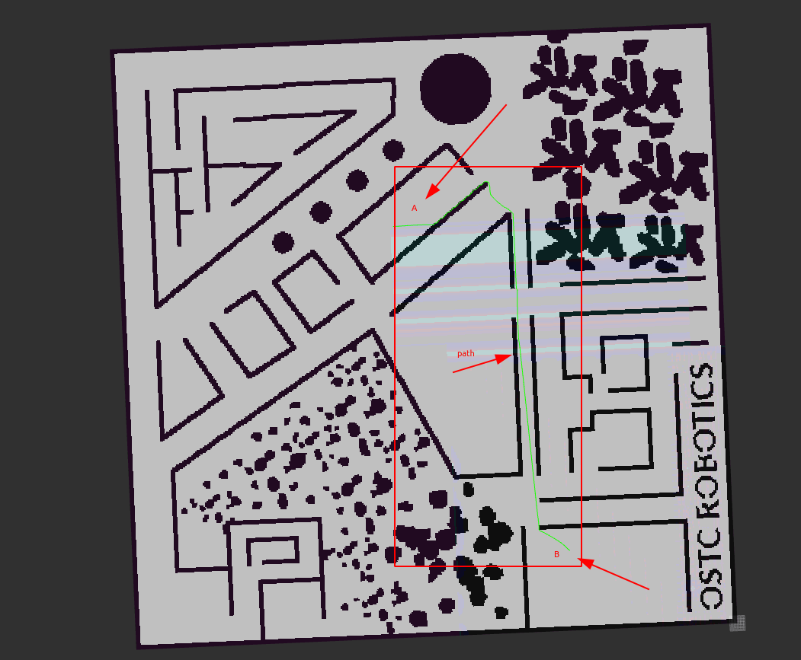

# Nav2-Path-Planner

* author :  duyongquan
* e-mail: quandy2020@126.com

## A* 算法路径规划

### 1 编译

```shell
cd ros2_ws
colcon build --packages-up-to nav2_demos
```


### 2 运行

```shell
# 配置环境变量
source install/setup.zsh 
or
source install/setup.bash

# ros2 launch 启动
ros2 launch nav2_demos tutorials_nav2_demo7_a_star_planner_test_launch.py
```

### 3 设置A点和B点，AB点路径规划

点击A点和B点，进行路径规划，可以选择自定义的地图




运行结果




code

```c++
#include "nav2_demos/tutorials_nav2_utils.hpp"

using namespace std::chrono_literals;

namespace ros2_tutorials
{
namespace nav2
{
namespace
{

class AStarPlanner : public rclcpp::Node
{
public:
    AStarPlanner() : Node("a_star_planner")
    {
        a_star_palnner_ = std::make_shared<PlannerTester>();
        pose_publisher_ = std::make_shared<PosesPublisher>(this);
        timer_ = create_wall_timer(
            2000ms, std::bind(&AStarPlanner::HandleTimerCallback, this));
    }

    ~AStarPlanner() {}

private:

    void HandleTimerCallback()
    {  
        RunTask();

        geometry_msgs::msg::PoseStamped start;
        geometry_msgs::msg::PoseStamped goal;
        bool start_ok = pose_publisher_->GetStartPoint(start);
        bool goal_ok = pose_publisher_->GetGoalPoint(goal);
        nav_msgs::msg::Path path;

        if (start_ok && goal_ok) {
            bool success = a_star_palnner_->createPlan(start, goal, path);
            if (!success) {
                RCLCPP_ERROR(this->get_logger(), "create path failed");
            } else {
                a_star_palnner_->publishPath(path);
            }
        }
    }

    void RunTask()
    {
        if (load_finished_) {
            return;
        }
        std::string pgm = GetMapsPath() + "map.pgm";
        a_star_palnner_->activate();
        a_star_palnner_->loadMap(pgm);
        load_finished_ = true;
    }

    rclcpp::TimerBase::SharedPtr timer_ {nullptr};
    std::shared_ptr<PosesPublisher> pose_publisher_ {nullptr};
    std::shared_ptr<PlannerTester> a_star_palnner_{nullptr};

    bool load_finished_{false};
};  
}

}  // namespace nav2WW
}  // namespace ros2_tutorials


int main(int argc, char ** argv)
{
  rclcpp::init(argc, argv);
  auto node = std::make_shared<ros2_tutorials::nav2::AStarPlanner>();
  rclcpp::spin(node);
  rclcpp::shutdown();
  return 0;
}
```


## 1 二叉树和图

### 1.1 二叉树的层次遍历


### 1.2 图的BFS & DFS


## 2 Dijkstra Path Planner


## 3 A* Path Planner


