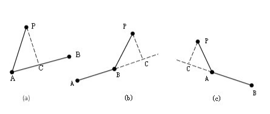
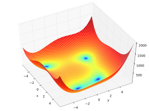
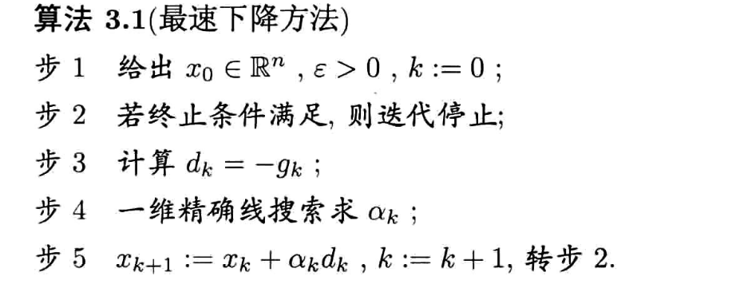
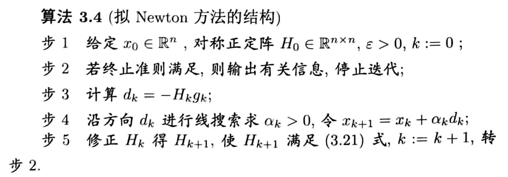

# Nav2-TEB-Controller

## 1 数学准备

### 1.1 点到线段的最短的点

由于矢量具有方向性，故一些方向的判断直接根据其正负号就可以得知，我们只需要找到向量 $\overrightarrow{AP}$ 在$\overrightarrow {AB}$方向上的投影，具体如下：



​	上面的 $\frac{\overrightarrow {AB}}{|\overrightarrow {AB}|}$是$\overrightarrow {AB}$方向上的单位向量，其意义是给所求向量确定方向。$\overrightarrow {AP} \cdot \overrightarrow {AB}$是两个向量的内积，且$\overrightarrow {AP}\cdot \overrightarrow {AB} = |\overrightarrow {AP}| |\overrightarrow {AB}|\cos(\theta)$，其中 $\theta$为向量 $\overrightarrow {AP}$与 $\overrightarrow {AB}$之间的夹角。$|\overrightarrow {AB}|$是向量长度。

​	 即为上图中线段 $\frac{\overrightarrow {AP}\cdot \overrightarrow {AB} }{|\overrightarrow {AB}|} = \frac{|\overrightarrow {AP}| |\overrightarrow {AB}|\cos(\theta)}{|\overrightarrow {AB}|} = |\overrightarrow {AP}|\cos{\theta}$的长度值，不带有方向性。此数值与上述表征方向的 $\frac{\overrightarrow {AB}}{|\overrightarrow {AB}|}$整体构成有大小、有方向的新向量 $\overrightarrow {AC}$，即为 $\overrightarrow {AP}$ 在 $\overrightarrow {AB}$方向上的投影向量，$C$为投影点。

​	根据得到的 $r = \frac{\overrightarrow {AP} \cdot \overrightarrow {AB}}{|\overrightarrow {AB}|^2}$，由向量的方向性可知：如果情况是上图 $(a)$ 所示，那么 $0 \lt r \lt 1$；如果是如图 $(b)$ 所示的情况，那么 $r \ge 1$；如果是如图 $(c)$ 所示的情况，那么得到 $r \le 0$。

​	特殊情况如点在线段上、点在端点、点在线段延长线上等等的情况全部适用于此公式，只是作为特殊情况出现，无需另作讨论。这也是矢量算法思想的优势所在。

​	故根据 $r$值的不同，最短距离：
$$
d =

\begin{cases}
    |\overrightarrow{AP}| \quad r \le 0 \\
    |\overrightarrow{BP}| \quad r \ge 1 \\
    |\overrightarrow{AC}| \quad  0 \lt r \lt 1
\end{cases}
$$
C++代码实现：

```c++
  
/**
 * @brief Helper function to obtain the closest point on a line segment w.r.t. a reference point
 * @param point 2D point
 * @param line_start 2D point representing the start of the line segment
 * @param line_end 2D point representing the end of the line segment
 * @return Closest point on the line segment
 */
inline Eigen::Vector2d closest_point_on_line_segment_2d(const Eigen::Ref<const Eigen::Vector2d>& point, const Eigen::Ref<const Eigen::Vector2d>& line_start, const Eigen::Ref<const Eigen::Vector2d>& line_end)
{
  Eigen::Vector2d diff = line_end - line_start;
  double sq_norm = diff.squaredNorm();
  
  if (sq_norm == 0)
    return line_start;

  double u = ((point.x() - line_start.x()) * diff.x() + (point.y() - line_start.y())*diff.y()) / sq_norm;
  
  if (u <= 0) return line_start;
  else if (u >= 1) return line_end;
  
  return line_start + u*diff;
}
```


### 1.2 点到线段的最短距离

C++代码实现：

```C++
/**
 * @brief Helper function to calculate the distance between a line segment and a point
 * @param point 2D point
 * @param line_start 2D point representing the start of the line segment
 * @param line_end 2D point representing the end of the line segment
 * @return minimum distance to a given line segment
 */
inline double distance_point_to_segment_2d(const Eigen::Ref<const Eigen::Vector2d>& point, const Eigen::Ref<const Eigen::Vector2d>& line_start, const Eigen::Ref<const Eigen::Vector2d>& line_end)
{
  return  (point - closest_point_on_line_segment_2d(point, line_start, line_end)).norm(); 
}
```


### 1.3 检测两条线段是否相交 


C++代码实现：

```c++
/**
 * @brief Helper function to check whether two line segments intersects
 * @param line1_start 2D point representing the start of the first line segment
 * @param line1_end 2D point representing the end of the first line segment
 * @param line2_start 2D point representing the start of the second line segment
 * @param line2_end 2D point representing the end of the second line segment
 * @param[out] intersection [optional] Write intersection point to destination (the value is only written, if both lines intersect, e.g. if the function returns \c true)
 * @return \c true if both line segments intersect
 */  
inline bool check_line_segments_intersection_2d(const Eigen::Ref<const Eigen::Vector2d>& line1_start, 
                                                const Eigen::Ref<const Eigen::Vector2d>& line1_end, 
                                                const Eigen::Ref<const Eigen::Vector2d>& line2_start, 
                                                const Eigen::Ref<const Eigen::Vector2d>& line2_end, 
                                                Eigen::Vector2d* intersection = NULL)
{
  // http://stackoverflow.com/questions/563198/how-do-you-detect-where-two-line-segments-intersect
  double s_numer, t_numer, denom, t;
  Eigen::Vector2d line1 = line1_end - line1_start;
  Eigen::Vector2d line2 = line2_end - line2_start;
  
  denom = line1.x() * line2.y() - line2.x() * line1.y();
  if (denom == 0) return false; // Collinear
  bool denomPositive = denom > 0;

  Eigen::Vector2d aux = line1_start - line2_start;
  
  s_numer = line1.x() * aux.y() - line1.y() * aux.x();
  if ((s_numer < 0) == denomPositive)  return false; // No collision

  t_numer = line2.x() * aux.y() - line2.y() * aux.x();
  if ((t_numer < 0) == denomPositive)  return false; // No collision

  if (((s_numer > denom) == denomPositive) || ((t_numer > denom) == denomPositive)) return false; // No collision
  
  // Otherwise collision detected
  t = t_numer / denom;
  if (intersection)
  {
    *intersection = line1_start + t * line1;
  }

  return true;
}
```


### 1.4 两点段之间的距离

C++代码实现：

```C++
/**
 * @brief Helper function to calculate the smallest distance between two line segments
 * @param line1_start 2D point representing the start of the first line segment
 * @param line1_end 2D point representing the end of the first line segment
 * @param line2_start 2D point representing the start of the second line segment
 * @param line2_end 2D point representing the end of the second line segment
 * @return smallest distance between both segments
*/  
inline double distance_segment_to_segment_2d(const Eigen::Ref<const Eigen::Vector2d>& line1_start, 
                                             const Eigen::Ref<const Eigen::Vector2d>& line1_end, 
                                             const Eigen::Ref<const Eigen::Vector2d>& line2_start, 
                                             const Eigen::Ref<const Eigen::Vector2d>& line2_end)
{  
  // check if segments intersect
  if (check_line_segments_intersection_2d(line1_start, line1_end, line2_start, line2_end))
    return 0;
  
  // check all 4 combinations
  std::array<double,4> distances;
  
  distances[0] = distance_point_to_segment_2d(line1_start, line2_start, line2_end);
  distances[1] = distance_point_to_segment_2d(line1_end, line2_start, line2_end);
  distances[2] = distance_point_to_segment_2d(line2_start, line1_start, line1_end);
  distances[3] = distance_point_to_segment_2d(line2_end, line1_start, line1_end);
  
  return *std::min_element(distances.begin(), distances.end());
}
```


### 1.5 点到多边形的距离

C++代码实现：

```C++
/**
 * @brief Helper function to calculate the smallest distance between a point and a closed polygon
 * @param point 2D point
 * @param vertices Vertices describing the closed polygon (the first vertex is not repeated at the end)
 * @return smallest distance between point and polygon
*/    
inline double distance_point_to_polygon_2d(const Eigen::Vector2d& point, const Point2dContainer& vertices)
{
  double dist = HUGE_VAL;
    
  // the polygon is a point
  if (vertices.size() == 1)
  {
    return (point - vertices.front()).norm();
  }
    
  // check each polygon edge
  for (int i=0; i<(int)vertices.size()-1; ++i)
  {
      double new_dist = distance_point_to_segment_2d(point, vertices.at(i), vertices.at(i+1));
      if (new_dist < dist)
        dist = new_dist;
  }

  if (vertices.size()>2) // if not a line close polygon
  {
    double new_dist = distance_point_to_segment_2d(point, vertices.back(), vertices.front()); // check last edge
    if (new_dist < dist)
      return new_dist;
  }
  
  return dist;
} 
```


###  1.6 线段到多边形的距离


C++代码实现：

```C++
/**
 * @brief Helper function to calculate the smallest distance between a line segment and a closed polygon
 * @param line_start 2D point representing the start of the line segment
 * @param line_end 2D point representing the end of the line segment
 * @param vertices Vertices describing the closed polygon (the first vertex is not repeated at the end)
 * @return smallest distance between point and polygon
*/    
inline double distance_segment_to_polygon_2d(const Eigen::Vector2d& line_start, const Eigen::Vector2d& line_end, const Point2dContainer& vertices)
{
  double dist = HUGE_VAL;
    
  // the polygon is a point
  if (vertices.size() == 1)
  {
    return distance_point_to_segment_2d(vertices.front(), line_start, line_end);
  }
    
  // check each polygon edge
  for (int i=0; i<(int)vertices.size()-1; ++i)
  {
      double new_dist = distance_segment_to_segment_2d(line_start, line_end, vertices.at(i), vertices.at(i+1));
      if (new_dist < dist)
        dist = new_dist;
  }

  if (vertices.size()>2) // if not a line close polygon
  {
    double new_dist = distance_segment_to_segment_2d(line_start, line_end, vertices.back(), vertices.front()); // check last edge
    if (new_dist < dist)
      return new_dist;
  }
  
  return dist;
}
```


### 1.7 多边形到多边形的距离


C++代码实现：

```C++
/**
 * @brief Helper function to calculate the smallest distance between two closed polygons
 * @param vertices1 Vertices describing the first closed polygon (the first vertex is not repeated at the end)
 * @param vertices2 Vertices describing the second closed polygon (the first vertex is not repeated at the end)
 * @return smallest distance between point and polygon
*/    
inline double distance_polygon_to_polygon_2d(const Point2dContainer& vertices1, const Point2dContainer& vertices2)
{
  double dist = HUGE_VAL;
    
  // the polygon1 is a point
  if (vertices1.size() == 1)
  {
    return distance_point_to_polygon_2d(vertices1.front(), vertices2);
  }
    
  // check each edge of polygon1
  for (int i=0; i<(int)vertices1.size()-1; ++i)
  {
      double new_dist = distance_segment_to_polygon_2d(vertices1[i], vertices1[i+1], vertices2);
      if (new_dist < dist)
        dist = new_dist;
  }

  if (vertices1.size()>2) // if not a line close polygon1
  {
    double new_dist = distance_segment_to_polygon_2d(vertices1.back(), vertices1.front(), vertices2); // check last edge
    if (new_dist < dist)
      return new_dist;
  }

  return dist;
}
```

## 2 函数求极值问题

### 2.1 最速下降法

* 求解Himmelblau's function函数的最小值
  $$
  \mathop {\min }\limits_x f(x) = (x^2 + y - 11)^2 + (x + y^2 - 7)^2
  $$

<center class="half">
    
    
</center>

函数有四个最小值点：
$$
\begin{aligned}
	f(3.0, 2.0) &= 0.0 \\
	f(-2.805118, 3.131312) &= 0.0 \\
	f(-3.779310, -3.283186) &= 0.0 \\
	f(3.584428, -1.848126) &= 0.0

\end{aligned}
$$

* 算法求解如下



* python代码

  ```python
  #!/usr/bin/python
  # -*- coding: utf-8 -*-
  import matplotlib.pyplot as plt
  import numpy as np
  import random
  
  delta = 0.1
  minXY = -5.0
  maxXY = 5.0
  nContour = 50
  alpha = 0.01
  
  
  def Jacob(state):
      u"""
      jacobi matrix of Himmelblau's function
      """
      x = state[0, 0]
      y = state[0, 1]
      dx = 4 * x ** 3 + 4 * x * y - 44 * x + 2 * x + 2 * y ** 2 - 14
      dy = 2 * x ** 2 + 4 * x * y + 4 * y ** 3 - 26 * y - 22
      J = np.matrix([dx, dy])
      return J
  
  
  def HimmelblauFunction(x, y):
      u"""
      Himmelblau's function
      see Himmelblau's function - Wikipedia, the free encyclopedia
      http://en.wikipedia.org/wiki/Himmelblau%27s_function
      """
      return (x ** 2 + y - 11) ** 2 + (x + y ** 2 - 7) ** 2
  
  
  def ConstrainFunction(x):
      return (2.0 * x + 1.0)
  
  
  def CreateMeshData():
      x = np.arange(minXY, maxXY, delta)
      y = np.arange(minXY, maxXY, delta)
      X, Y = np.meshgrid(x, y)
      Z = [HimmelblauFunction(ix, iy) for (ix, iy) in zip(X, Y)]
      return(X, Y, Z)
  
  
  def SteepestDescentMethod(start, Jacob):
      u"""
      Steepest Descent Method Optimization
      """
  
      result = start
      x = start
  
      while 1:
          J = Jacob(x)
          sumJ = np.sum(abs(alpha * J))
          if sumJ <= 0.01:
              print("OK")
              break
  
          x = x - alpha * J
          result = np.vstack((result, x))
  
      return result
  
  # Main
  start = np.matrix([random.uniform(minXY, maxXY), random.uniform(minXY, maxXY)])
  
  result = SteepestDescentMethod(start, Jacob)
  (X, Y, Z) = CreateMeshData()
  CS = plt.contour(X, Y, Z, nContour)
  
  Xc = np.arange(minXY, maxXY, delta)
  Yc = [ConstrainFunction(x) for x in Xc]
  
  plt.plot(start[0, 0], start[0, 1], "xr")
  plt.plot(result[:, 0], result[:, 1], "-r")
  plt.axis([minXY, maxXY, minXY, maxXY])
  plt.show()
  ```

​	结果如下：

<center class="half">
    
    
    
    
</center>

### 2.2 牛顿法

* 算法求解如下



* python代码

  ```python
  #!/usr/bin/python
  # -*- coding: utf-8 -*-
  
  import matplotlib.pyplot as plt
  import numpy as np
  import random
  
  delta = 0.1
  minXY=-5.0
  maxXY=5.0
  nContour=50
  alpha=0.01
  
  def Hessian(state):
      u"""
      Hessian matrix of Himmelblau's function
      """
      x=state[0]
      y=state[1]
      dxx=12*x**2+4*y-42;
      dxy=4*x+4*y
      dyy=4*x+12*y**2-26
      H=np.array([[dxx,dxy],[dxy,dyy]])
      return H
      
  
  def Jacob(state):
      u"""
      jacobi matrix of Himmelblau's function
      """
      x=state[0]
      y=state[1]
      dx=4*x**3+4*x*y-44*x+2*x+2*y**2-14
      dy=2*x**2+4*x*y+4*y**3-26*y-22
      J=[dx,dy]
      return J
  
  def HimmelblauFunction(x,y):
      u"""
      Himmelblau's function
      see Himmelblau's function - Wikipedia, the free encyclopedia 
      http://en.wikipedia.org/wiki/Himmelblau%27s_function
      """
      return (x**2+y-11)**2+(x+y**2-7)**2
  
  def CreateMeshData():
      x = np.arange(minXY, maxXY, delta)
      y = np.arange(minXY, maxXY, delta)
      X, Y = np.meshgrid(x, y)
      Z=[HimmelblauFunction(x,y) for (x,y) in zip(X,Y)]
      return(X,Y,Z)
  
  def NewtonMethod(start,Jacob):
      u"""
      Newton Method Optimization
      """
  
      result=start
      x=start
  
      while 1:
          J=Jacob(x)
          H=Hessian(x)
          sumJ=sum([abs(alpha*j) for j in J])
          if sumJ<=0.01:
              print("OK")
              break
  
          grad=-np.linalg.inv(H).dot(J) 
          print(grad)
  
          x=x+[alpha*j for j in grad]
          
          result=np.vstack((result,x))
  
      return result
  
  # Main
  start=np.array([random.uniform(minXY,maxXY),random.uniform(minXY,maxXY)])
  
  result=NewtonMethod(start,Jacob)
  (X,Y,Z)=CreateMeshData()
  CS = plt.contour(X, Y, Z,nContour)
  
  plt.plot(start[0],start[1],"xr");
  
  optX=[x[0] for x in result]
  optY=[x[1] for x in result]
  plt.plot(optX,optY,"or-");
  plt.show()
  ```

### 2.3 罚函数法


## 3 TEB算法

### 3.1 问题描述


### 3.2 最小二乘法


### 3.3 G2O求解TEB问题


