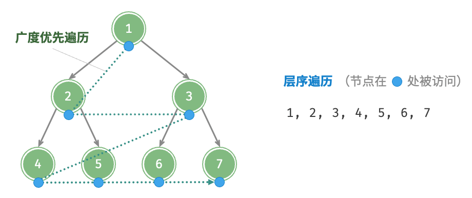
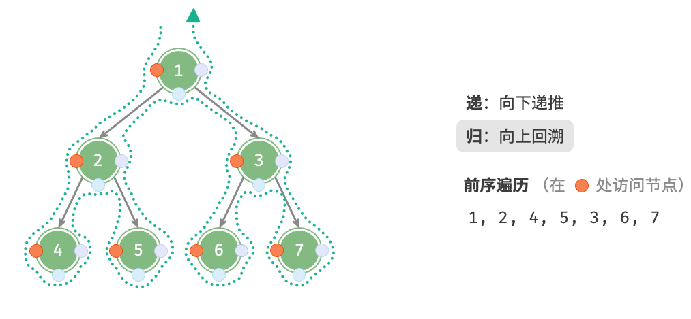
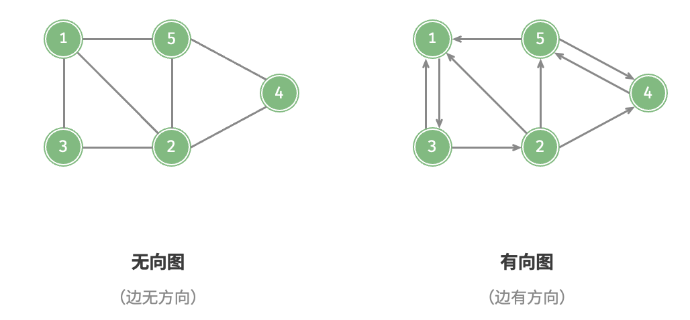
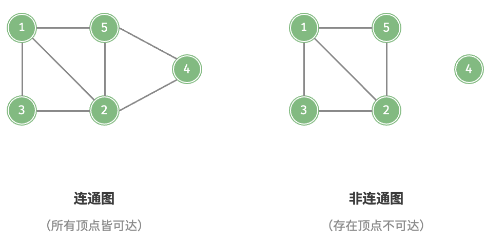
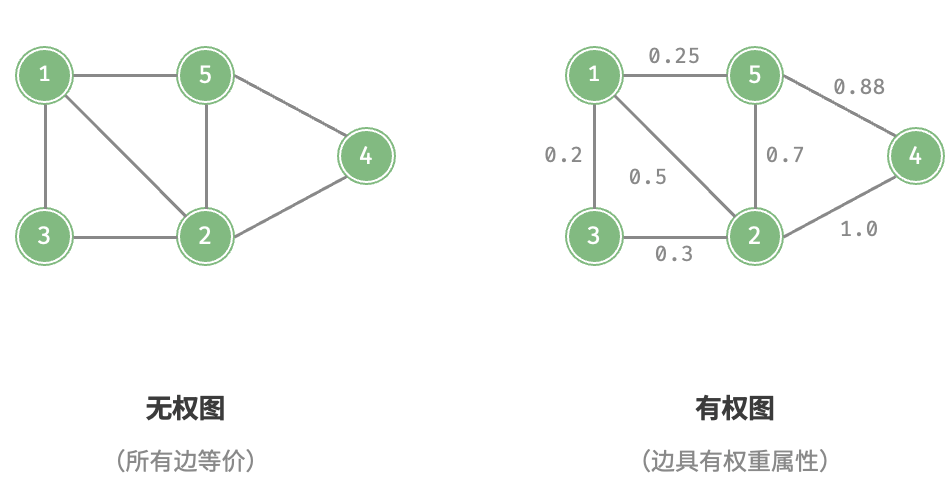
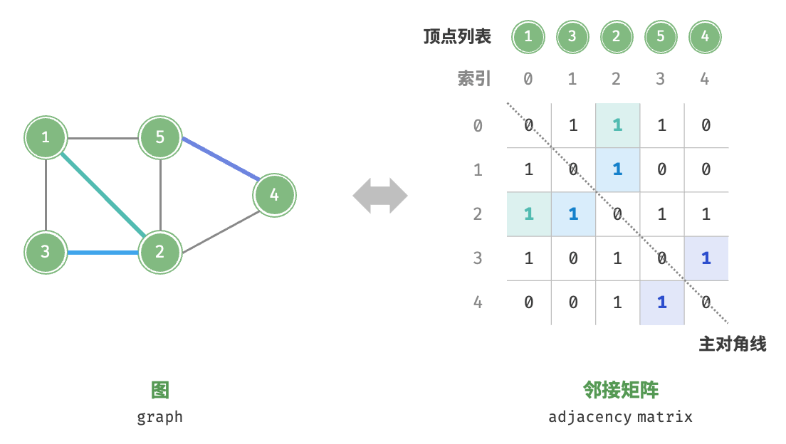
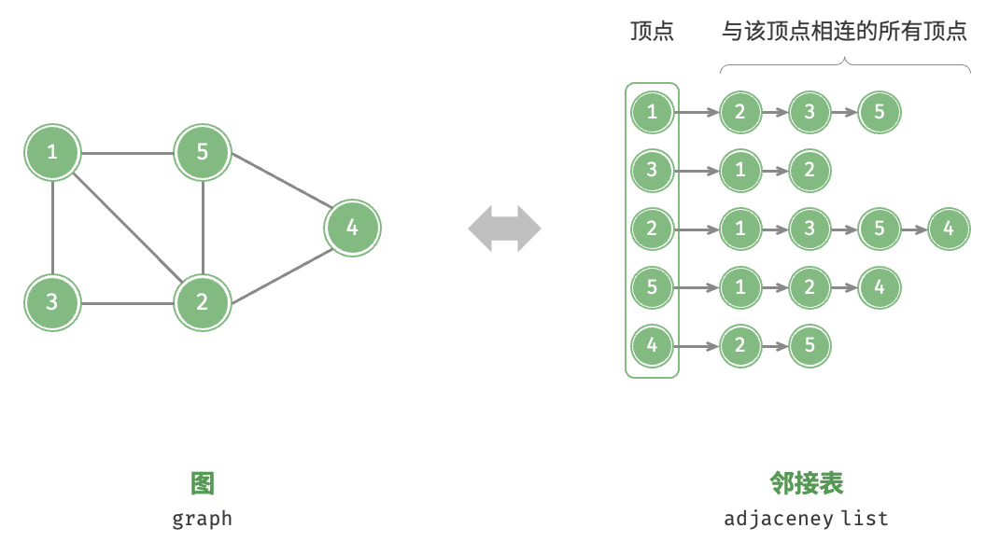

<center> <font color=green size=9>  BT & Graph </font></center>

quandy2020@126.com

## 二叉树的遍历

### BFS

* 二叉树结构

  ```c++
  /* 二叉树节点结构体 */
  struct TreeNode {
      int val;          // 节点值
      TreeNode *left;   // 左子节点指针
      TreeNode *right;  // 右子节点指针
      TreeNode(int x) : val(x), left(nullptr), right(nullptr) {}
  };
  ```

* 二叉树广度优先遍历



广度优先遍历通常借助“队列”来实现。队列遵循“先进先出”的规则，而广度优先遍历则遵循“逐层推进”的规则，两者背后的思想是一致的。

* C++代码

  ```c++
  void bfs(TreeNode* root) {
  	if(!root)
  		return;
      // 初始化队列，加入根节点
  	queue<TreeNode*> que;
  	que.push(root);
  	while(!que.empty()){
  		auto node = que.front();
  		que.pop();	// 队列出队
  		cout << node->val << endl;
  		if(node->left) que.push(node->left);   // 左子节点入队
  		if(node->right) que.push(node->right); // 右子节点入队
  	}
  	return res;
  }
  ```

### DFS

* 二叉树深度优先遍历



* C++代码

  ```C++
  void dfs(TreeNode* root, vector<int>& res){
      if(nullptr == root) return;
      stack<TreeNode*> s;
      s.push(root);
      while(!s.empty()){
          TreeNode* node = s.top();
          res.push_back(node->val);
          s.pop();
          if(nullptr != node->right) s.push(node->right);
          if(nullptr != node->left) s.push(node->left);
      }  
  }
  ```


## Graph

### graph分类

* 无向图 & 有向图

  

* 连通图 connected graph」和「非连通图 disconnected graph

  


* 有权图 weighted graph

  

### 图的表示

<table style="width:100%">
     <tr>
        <th>
          <p align="center">
               
               <br>ROS2 Topic
          </p>
        </th>
            <th><p align="center">
               
               <br>ROS2 Service
            </p>
        </th>
    </tr>
</table>


* 「邻接表 adjacency list」使用 $n$个链表来表示图，链表节点表示顶点。第 $i$个链表对应顶点 $i$，其中存储了该顶点的所有邻接顶点（与该顶点相连的顶点）。
* 「邻接矩阵 adjacency matrix」使用一个 $n \times n$ 大小的矩阵来表示图，每一行（列）代表一个顶点，矩阵元素代表边，用 1 或 0 表示两个顶点之间是否存在边。

### BFS

* C++代码

  ```c++
  /* 广度优先遍历 */
  // 使用邻接表来表示图，以便获取指定顶点的所有邻接顶点
  vector<Vertex *> graphBFS(GraphAdjList &graph, Vertex *startVet) {
      // 顶点遍历序列
      vector<Vertex *> res;
      // 哈希表，用于记录已被访问过的顶点
      unordered_set<Vertex *> visited = {startVet};
      // 队列用于实现 BFS
      queue<Vertex *> que;
      que.push(startVet);
      // 以顶点 vet 为起点，循环直至访问完所有顶点
      while (!que.empty()) {
          Vertex *vet = que.front();
          que.pop();          // 队首顶点出队
          res.push_back(vet); // 记录访问顶点
          // 遍历该顶点的所有邻接顶点
          for (auto adjVet : graph.adjList[vet]) {
              if (visited.count(adjVet))
                  continue;            // 跳过已被访问的顶点
              que.push(adjVet);        // 只入队未访问的顶点
              visited.emplace(adjVet); // 标记该顶点已被访问
          }
      }
      // 返回顶点遍历序列
      return res;
  }
  ```

### DFS

* C++代码

  ```C++
  /* 深度优先遍历辅助函数 */
  void dfs(GraphAdjList &graph, unordered_set<Vertex *> &visited, vector<Vertex *> &res, Vertex *vet) {
      res.push_back(vet);   // 记录访问顶点
      visited.emplace(vet); // 标记该顶点已被访问
      // 遍历该顶点的所有邻接顶点
      for (Vertex *adjVet : graph.adjList[vet]) {
          if (visited.count(adjVet))
              continue; // 跳过已被访问的顶点
          // 递归访问邻接顶点
          dfs(graph, visited, res, adjVet);
      }
  }
  
  /* 深度优先遍历 */
  // 使用邻接表来表示图，以便获取指定顶点的所有邻接顶点
  vector<Vertex *> graphDFS(GraphAdjList &graph, Vertex *startVet) {
      // 顶点遍历序列
      vector<Vertex *> res;
      // 哈希表，用于记录已被访问过的顶点
      unordered_set<Vertex *> visited;
      dfs(graph, visited, res, startVet);
      return res;
  }
  ```

## 参考

* https://www.hello-algo.com/chapter_graph/graph/#911