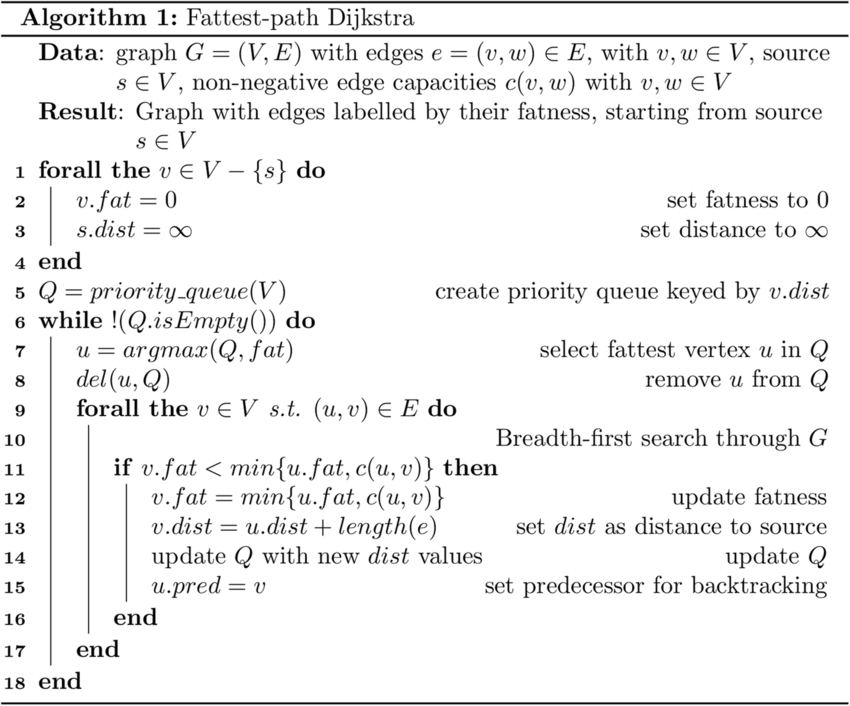
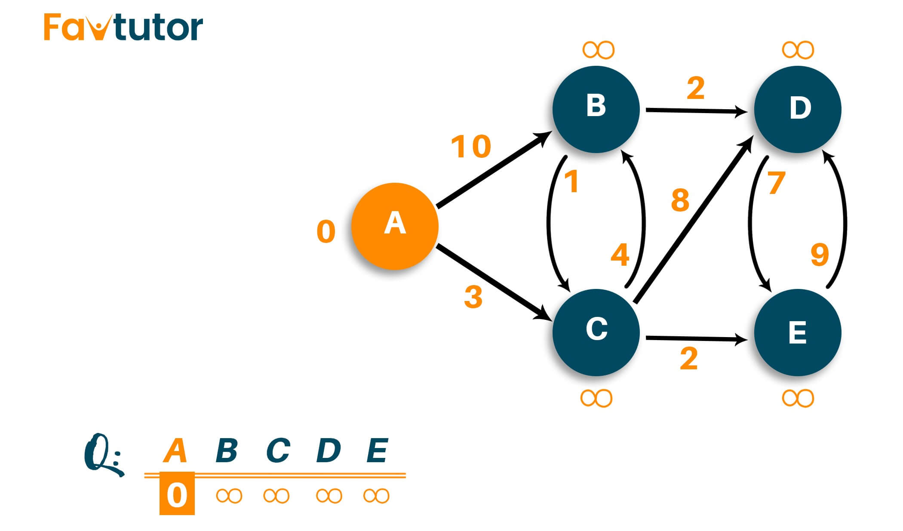
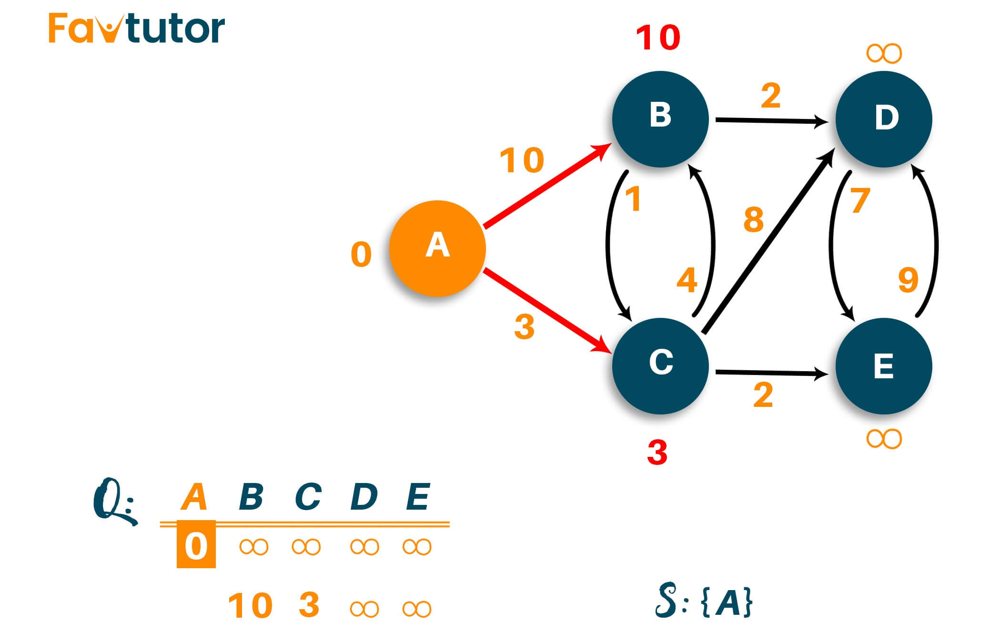
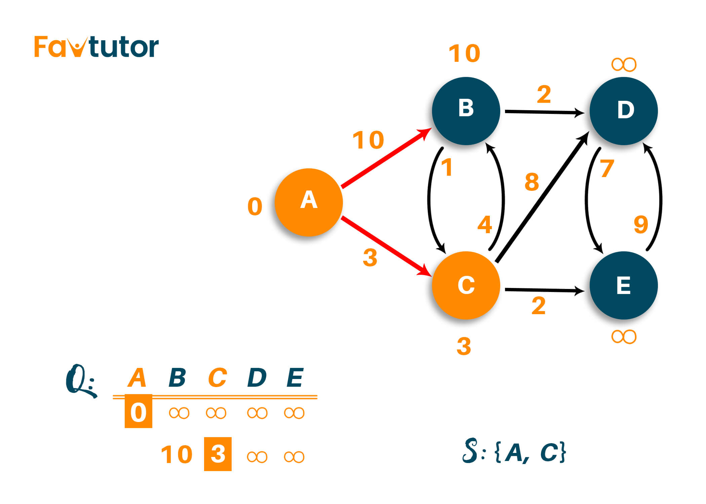
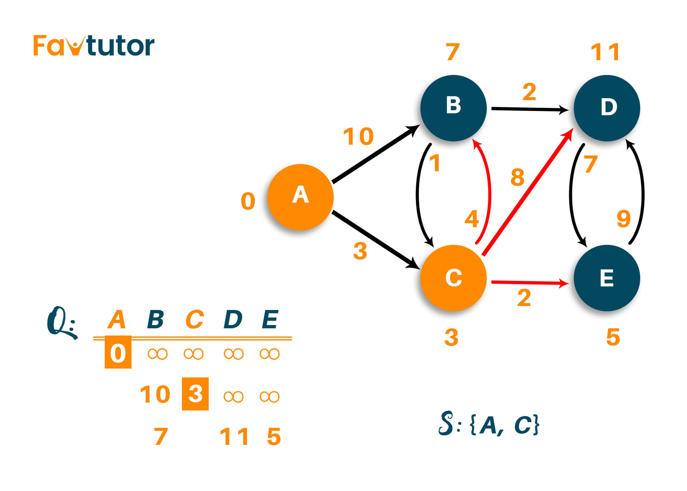
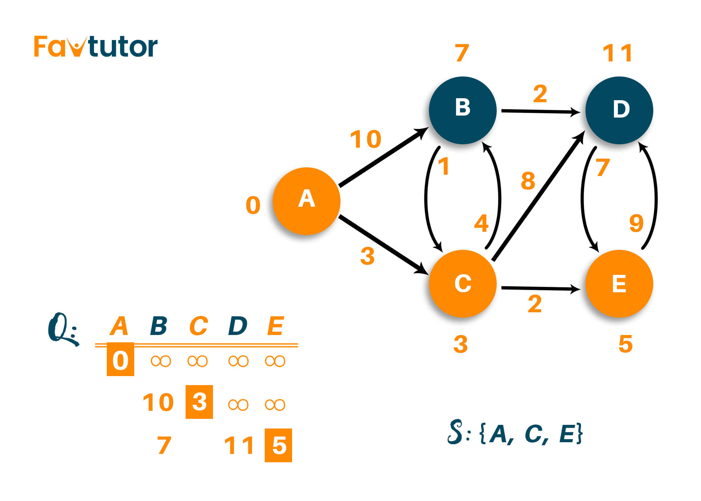
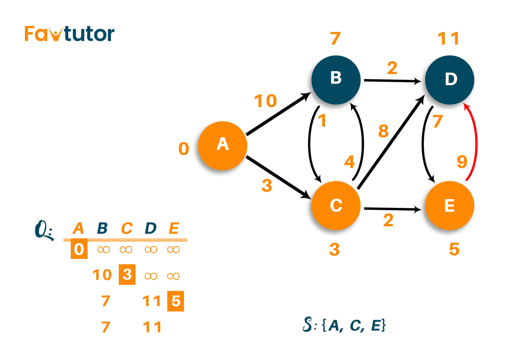
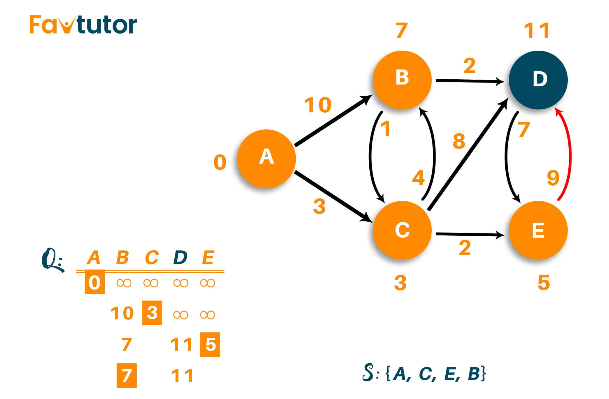
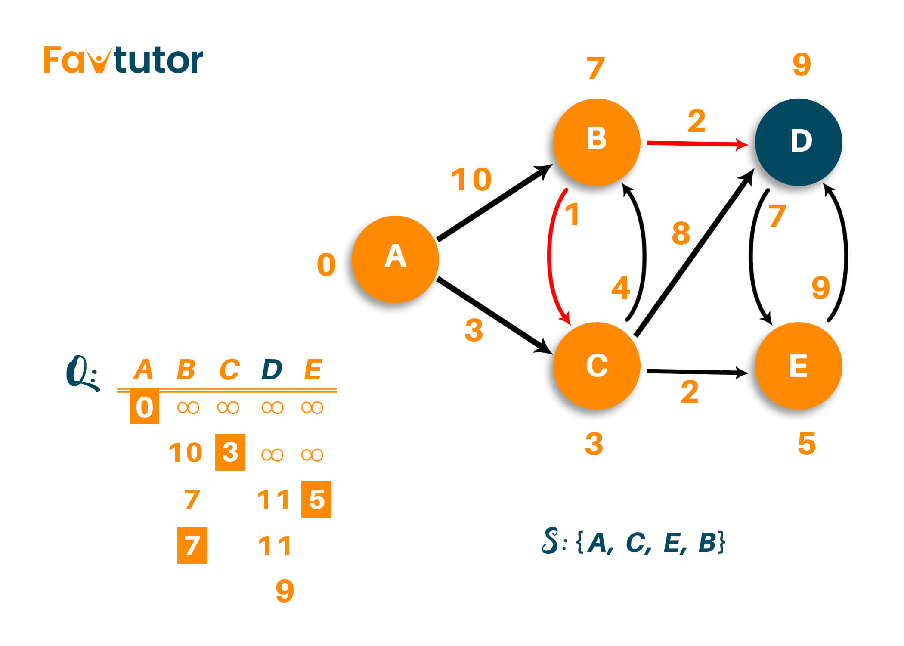
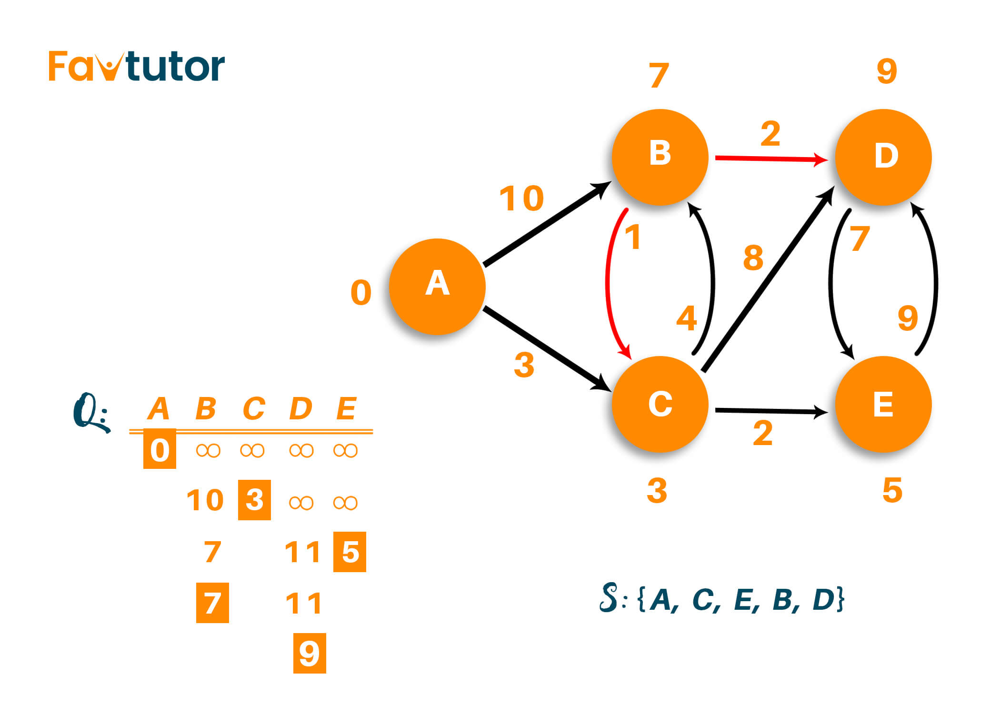

<center> <font color=green size=9> Dijkstra </font> </center>

quandy2020@126.com

## Dijkstra 算法



Dijkstra 算法也称为最短路径算法。它是一种用于查找图形节点之间最短路径的算法。该算法从图中所有其他点的起始源顶点创建最短路径树。它与最小生成树不同，因为两个顶点之间的最短距离可能不包含在图形的所有顶点中。该算法的工作原理是构建一组与源具有最小距离的节点。在这里，Dijkstra 的算法使用贪婪的方法来解决问题并找到最佳解决方案。

## **C++ 中 Dijkstra 算法的伪代码**

```c++
function dijkstra(G, S)
    for each vertex V in G
        dist[V] <- infinite
        prev[V] <- NULL
        If V != S, add V to Priority Queue Q
    dist[S] <- 0
    
    while Q IS NOT EMPTY
        U <- Extract MIN from Q
        for each unvisited neighbour V of U
            temperoryDist <- dist[U] + edgeWeight(U, V)
            if temperoryDist < dist[V]
                dist[V] <- temperoryDist
                prev[V] <- U
    return dist[], prev[]
```


## **Example**

这里给了我们一个加权图，我们将选择顶点“A”作为图的起点。



由于算法生成从源顶点到其他每个顶点的最短路径，我们将源顶点与自身的距离设置为“0”。从源顶点到所有其他顶点的距离尚未确定，因此，我们将使用无穷大来表示它。

目前，未访问的节点列表为：{B， C， D， E}



在这里，我们将开始检查从节点“A”到其相邻顶点的距离。您可以看到相邻的顶点是“B”和“C”，权重分别为“10”和“3”。请记住，您不必立即将两个顶点添加到最短路径中。首先，我们将从无穷大到给定权重的距离更新。然后，我们必须根据更新的权重选择最接近源节点的节点。将其标记为已访问，并将其添加到路径中。如下图所示，我们将顶点 B 从无穷大更新为 10，将顶点 C 从无穷大更新为 3。



现在选择路径长度较小的顶点作为访问的顶点，并将其放入答案中。因此，未访问的节点列表为 {B， D， E}



现在，我们必须分析新的相邻顶点以找到最短路径。因此，我们将访问被访问顶点的相邻节点，并根据需要更新路径长度。在这里，我们将 B、D 和 E 作为节点“A”和节点“C”的相邻顶点。 因此，我们将所有三个顶点的路径从无穷大更新为它们各自的权重，如下图所示。

请注意，节点“B”直接与节点“A”相邻，因此，节点“B”的权重将与显示的相同。但是对于节点“D”和节点“E”，路径是通过节点“C”计算的，因此该顶点的权重将为 11 和 5，因为我们分别将路径 A->C->D 和 A->C->E 的边权重相加。



现在，从上表中选择最短路径将导致选择与源顶点最短距离为 5 的节点“E”。因此，未访问的节点列表为 {B， D}

重复该过程，直到访问完所有顶点。这里，顶点 'B' 和顶点 'D' 都被认为是相邻的顶点，两个顶点到源节点的最短距离没有变化，如下图所示。



因此，与顶点“D”相比，顶点“B”的权重最小，因此我们将其标记为访问节点并将其添加到路径中。未访问的节点列表将为 {D}



在访问顶点“B”之后，我们只剩下访问顶点“D”.如果你仔细观察，从源顶点到顶点“D”的距离可以从前一个修改，即，我们可以通过顶点“B”访问它，而不是直接通过顶点“C”访问顶点“D”，总距离为9。那是因为我们添加了边缘的权重，例如 A->C->B->D （3+4+2=9），如下所示。



因此，算法的最终输出将是 {A， C， E， B， D}



## C++代码

```c++
#include
#include
using namespace std;

int miniDist(int distance[], bool Tset[]) // finding minimum distance
{
    int minimum=INT_MAX,ind;
              
    for(int k=0;k<6;k++) 
    {
        if(Tset[k]==false && distance[k]<=minimum)      
        {
            minimum=distance[k];
            ind=k;
        }
    }
    return ind;
}

void DijkstraAlgo(int graph[6][6],int src) // adjacency matrix 
{
    int distance[6]; // // array to calculate the minimum distance for each node                             
    bool Tset[6];// boolean array to mark visited and unvisited for each node
    
     
    for(int k = 0; k<6; k++)
    {
        distance[k] = INT_MAX;
        Tset[k] = false;    
    }
    
    distance[src] = 0;   // Source vertex distance is set 0               
    
    for(int k = 0; k<6; k++)                           
    {
        int m=miniDist(distance,Tset); 
        Tset[m]=true;
        for(int k = 0; k<6; k++)                  
        {
            // updating the distance of neighbouring vertex
            if(!Tset[k] && graph[m][k] && distance[m]!=INT_MAX && distance[m]+graph[m][k]<distance[k])
                distance[k]=distance[m]+graph[m][k];
        }
    }
    cout<<"Vertex\t\tDistance from source vertex"<<endl;
    for(int k = 0; k<6; k++)                      
    { 
        char str=65+k; 
        cout<<str<<"\t\t\t"<<distance[k]<<endl;
    }
}

int main()
{
    int graph[6][6]={
        {0, 1, 2, 0, 0, 0},
        {1, 0, 0, 5, 1, 0},
        {2, 0, 0, 2, 3, 0},
        {0, 5, 2, 0, 2, 2},
        {0, 1, 3, 2, 0, 1},
        {0, 0, 0, 2, 1, 0}};
    DijkstraAlgo(graph,0);
    return 0;                           
}
```

* 参考 https://favtutor.com/blogs/dijkstras-algorithm-cpp