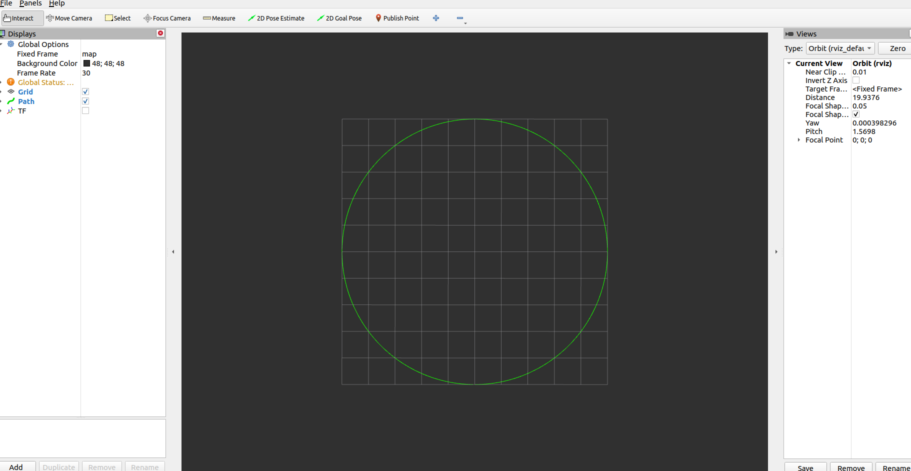

<center>  <font size=10 color='green'> ros2_tutorials —— RVIZ使用 </font></center>

<center> <font size=6 color=red > Part I 可视化(Publisher) </font></font></center>

# 1 Marker 


## 1.1 简介


## 1.2 显示一个圆轨迹

### 1.2.1 功能简介

> 显示一条圆形轨迹

### 1.2.2 代码

* CMakeList.txt

  ```CMake
  cmake_minimum_required(VERSION 3.8)
  project(rviz)
  
  # Default to C++14
  if(NOT CMAKE_CXX_STANDARD)
    set(CMAKE_CXX_STANDARD 14)
  endif()
  
  if(CMAKE_COMPILER_IS_GNUCXX OR CMAKE_CXX_COMPILER_ID MATCHES "Clang")
    add_compile_options(-Wall -Wextra -Wpedantic)
  endif()
  
  # find dependencies
  find_package(ament_cmake REQUIRED)
  find_package(rclcpp REQUIRED)
  find_package(std_msgs REQUIRED)
  find_package(nav2_msgs REQUIRED)
  find_package(nav_msgs REQUIRED)
  find_package(tf2 REQUIRED)
  find_package(tf2_geometry_msgs REQUIRED)
  find_package(visualization_msgs REQUIRED)
  
  # include
  include_directories(
    include
  )
  
  # dependency
  set(DEPS 
    rclcpp
    std_msgs
    nav2_msgs
    nav_msgs
    tf2
    tf2_geometry_msgs
    visualization_msgs)
  
  # sources
  set(SRCS 
    src/tutorials_rviz_demo1_initial_env.cpp)
  
  # demo1
  add_executable(tutorial.topic.demo1_initial_env_test ${SRCS} src/tutorials_rviz_demo1_initial_env_test.cpp)
  ament_target_dependencies(tutorial.topic.demo1_initial_env_test ${DEPS})
  
  install(TARGETS
    tutorial.topic.demo1_initial_env_test
    DESTINATION lib/${PROJECT_NAME}
  )
  
  install(DIRECTORY launch DESTINATION share/${PROJECT_NAME})
  
  
  if(BUILD_TESTING)
    find_package(ament_lint_auto REQUIRED)
    ament_lint_auto_find_test_dependencies()
  endif()
  
  ament_package()
  
  ```

* launch文件

  ```perl
  import os
  
  from ament_index_python.packages import get_package_share_directory
  
  from launch import LaunchDescription
  from launch.actions import DeclareLaunchArgument, SetEnvironmentVariable
  from launch.substitutions import LaunchConfiguration
  from launch_ros.actions import Node
  
  def generate_launch_description():
  
      namespace = LaunchConfiguration('namespace')
      use_sim_time = LaunchConfiguration('use_sim_time')
  
      return LaunchDescription([
          # Set env var to print messages to stdout immediately
          SetEnvironmentVariable('RCUTILS_LOGGING_BUFFERED_STREAM', '1'),
  
          DeclareLaunchArgument(
              'namespace', default_value='',
              description='Top-level namespace'),
  
          DeclareLaunchArgument(
              'use_sim_time', default_value='false',
              description='Use simulation (Gazebo) clock if true'),
  
          declare_rviz_config_file_cmd = DeclareLaunchArgument(
              'rviz_config_file',
              default_value=os.path.join(
                  rviz, 'rviz', 'demo1_view.rviz'),
              description='Full path to the RVIZ config file to use')
  
          Node(
              package='rviz',
              executable='tutorial.topic.demo1_initial_env_test',
              output='screen',
              # prefix=['xterm -e gdb  --args'],
          )
      ])
  
  ```

* 头文件tutorials_rviz_demo1_initial_env.hpp

  ```cpp
  #include "rclcpp/rclcpp.hpp"
  #include "std_msgs/msg/string.hpp"
  #include "nav_msgs/msg/path.hpp"
  
  class ShowCircleTrajectory : public rclcpp::Node
  {
  public:
      ShowCircleTrajectory();
      ~ShowCircleTrajectory();
  
  private:
      void PublishPath();
      void HandleTimerCallback();
  
      rclcpp::Publisher<nav_msgs::msg::Path>::SharedPtr path_publisher_;
      rclcpp::TimerBase::SharedPtr timer_;
  };
  ```

*  源文件tutorials_rviz_demo1_initial_env.cpp

  ```cpp
  ShowCircleTrajectory::ShowCircleTrajectory()
  : Node("TrajectoryCircle")
  {
      path_publisher_ = this->create_publisher<nav_msgs::msg::Path>("circle_trajectory", 10);
      timer_ = this->create_wall_timer(1s, std::bind(&ShowCircleTrajectory::HandleTimerCallback, this));
  }
  
  ShowCircleTrajectory::~ShowCircleTrajectory()
  {
  }
  
  void ShowCircleTrajectory::HandleTimerCallback()
  {
      PublishPath();
  }
  
  void ShowCircleTrajectory::PublishPath()
  {
      const double pi_2 = 6.28;
      auto path = nav_msgs::msg::Path();
  
      path.header.stamp =  this->get_clock()->now();
      path.header.frame_id = "map";
  
      geometry_msgs::msg::PoseStamped pose;
      pose.header = path.header;
      pose.pose.position.z = 0.0;
  
      // circle
      for (std::size_t i = 0; i < 1000 ; i++) {
  
          double theta =  (i * pi_2 )/ 1000;
          double radius = 5.0f;
  
          double x = radius * std::cos(theta);
          double y = radius * std::sin(theta);
          pose.pose.position.x = x;
          pose.pose.position.y = y;
  
          // std::cout << "i = " << i << std::endl;
          path.poses.push_back(pose);
      }
  
      path_publisher_->publish(path);
  }
  ```

* 测试文件tutorials_rviz_demo1_initial_env_test.cpp

  ```cpp
  #include "rviz/tutorials_rviz_demo1_initial_env.hpp"
  
  int main(int argc, char ** argv)
  {
    rclcpp::init(argc, argv);
    auto node = std::make_shared<ros2_tutorials::rviz::ShowCircleTrajectory>();
    rclcpp::spin(node);
    rclcpp::shutdown();
    return 0;
  }
  ```

### 1.2.3 编译

```shell
colcon build  --packages-up-to rviz
```

### 1.2.4 运行

```shell
ros2 launch rviz tutorials.rviz.demo1_initial_env.launch.py
```

### 1.2.5结果




## 1.3 显示一个立方体

### 1.3.1 功能简介

> RVIZ显示一个立方体


### 1.3.2 代码


### 1.3.3 编译


### 1.3.4 运行


### 1.3.5 结果


## 1.4 显示一个球体


## 1.5 显示线带


## 1.6  显示一个机器人


## 1.7 显示图片


## 1.8 可交互障碍物


<center> <font size=6 color=red > Part II RVIZ插件(Qt编程可视化插件) </font></font></center>

# 2 插件（plugin）

