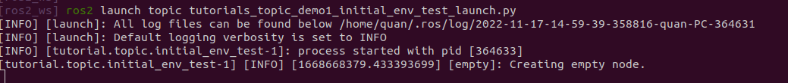
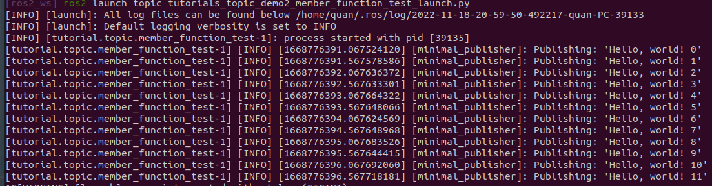
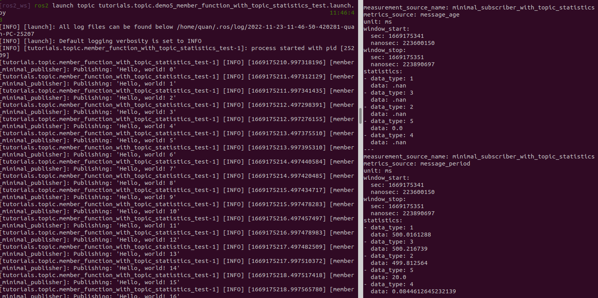

<center>  <font size=10 color='green'> ros2_tutorials —— topic使用 </font></center>

<center> <font color=red size=8> Part I 订阅者(Publisher) </font> </center>

# 1 tutorial 1(initial_env_test)

## 1.1 功能介绍

> 环境搭建，打印一句话

## 1.2 代码

**头文件tutorials_topic_demo1_initial_env.hpp**

```c++
#include <chrono>
#include <memory>
#include <string>

#include "rclcpp/rclcpp.hpp"
#include "std_msgs/msg/string.hpp"


namespace ros2_tutorials
{
namespace topic
{

class EmptyNode : public rclcpp::Node
{
public:
    EmptyNode();
    ~EmptyNode();
};

}  // namespace topic
}  // namespace ros2_tutorials
```

**tutorials_topic_demo1_initial_env.cpp**

```cpp
#include "topic/tutorials_topic_demo1_initial_env.hpp"

namespace ros2_tutorials
{
namespace topic
{

EmptyNode::EmptyNode()
: Node("empty")
{
    RCLCPP_INFO(get_logger(), "Creating empty node.");
}

EmptyNode::~EmptyNode()
{
}

}  // namespace topic
}  // namespace ros2_tutorials
```

**测试文件tutorials_topic_demo1_initial_env_test.cpp**

```cpp
#include "topic/tutorials_topic_demo1_initial_env.hpp"

int main(int argc, char ** argv)
{
  rclcpp::init(argc, argv);
  auto empty_node = std::make_shared<ros2_tutorials::topic::EmptyNode>();
  rclcpp::spin(empty_node);
  rclcpp::shutdown();
  return 0;
}

```

## 1.3 编译

```perl
colcon build  --packages-up-to topic
```

## 1.4 运行

source环境变量

```shell
source install/setup.zsh
```

方式1

```shell
cd install/topic/lib/topic/
./tutorial.topic.initial_env_test
```

方式2

```shell
ros2 launch topic tutorials_topic_demo1_initial_env_test_launch.py
```

## 1.5 运行结果




# 2 tutorial 2(member_function_test)

## 2.1  功能介绍

> 创建一个消息发布者，每隔500ms发布一次消息“'Hello, world!”

## 2.2 代码

**头文件**tutorials_topic_demo2_member_function.hpp

```c++
class MinimalPublisher : public rclcpp::Node
{
public:
    MinimalPublisher();
    ~MinimalPublisher();

private:
    void HandleTimerCallback();
    rclcpp::TimerBase::SharedPtr timer_;
    rclcpp::Publisher<std_msgs::msg::String>::SharedPtr publisher_;
    size_t count_;
};
```

**源文件tutorials_topic_demo2_member_function.cpp**

```cpp
MinimalPublisher::MinimalPublisher()
: Node("minimal_publisher"), count_(0)
{
    publisher_ = this->create_publisher<std_msgs::msg::String>("topic", 10);
    timer_ = this->create_wall_timer(
        500ms, std::bind(&MinimalPublisher::HandleTimerCallback, this));
}

MinimalPublisher::~MinimalPublisher()
{
}

void MinimalPublisher::HandleTimerCallback()
{
    auto message = std_msgs::msg::String();
    message.data = "Hello, world! " + std::to_string(count_++);
    RCLCPP_INFO(this->get_logger(), "Publishing: '%s'", message.data.c_str());
    publisher_->publish(message);
}
```

**测试文件tutorials_topic_demo2_member_function_test.cpp**

```cpp
#include "topic/tutorials_topic_demo2_member_function.hpp"

int main(int argc, char ** argv)
{
  rclcpp::init(argc, argv);
  auto publisher_node = std::make_shared<ros2_tutorials::topic::MinimalPublisher>();
  rclcpp::spin(publisher_node);
  rclcpp::shutdown();
  return 0;
}
```

## 2.3 编译

```perl
colcon build  --packages-up-to topic
```

## 2.4 运行

source环境变量

```shell
source install/setup.zsh
```

方式1

```shell
cd install/topic/lib/topic/
./tutorial.topic.tutorial.topic.member_function_test
```

方式2

```shell
ros2 launch topic tutorials_topic_demo2_member_function_test_launch.py
```

## 2.5 运行结果



# 3 tutorial 3(lambda_test)

## 3.1  功能介绍

> 创建一个消息发布者（处理函数是lambda表达式），每隔500ms发布一次消息“'Hello, world!”

## 3.2 代码

**头文件**tutorials_topic_demo3_lambda_test.hpp

```c++
class MinimalPublisherWithLambda : public rclcpp::Node
{
public:
  MinimalPublisherWithLambda();

private:
  rclcpp::TimerBase::SharedPtr timer_;
  rclcpp::Publisher<std_msgs::msg::String>::SharedPtr publisher_;
  size_t count_;
};
```

**源文件tutorials_topic_demo3_lambda_test.cpp**

```cpp
MinimalPublisherWithLambda::MinimalPublisherWithLambda()
 : Node("lambda_minimal_publisher"), count_(0)
{
    publisher_ = this->create_publisher<std_msgs::msg::String>("topic", 10);
    auto timer_callback = [this]() -> void {
            auto message = std_msgs::msg::String();
            message.data = "Hello, world! " + std::to_string(this->count_++);
            RCLCPP_INFO(this->get_logger(), "Publishing: '%s'", message.data.c_str());
            this->publisher_->publish(message);
        };
    timer_ = this->create_wall_timer(500ms, timer_callback);
}
```

**测试文件tutorials_topic_demo3_lambda_test.cpp**

```cpp
#include "topic/tutorials_topic_demo3_lambda.hpp"

int main(int argc, char ** argv)
{
  rclcpp::init(argc, argv);
  auto empty_node = std::make_shared<ros2_tutorials::topic::MinimalPublisherWithLambda>();
  rclcpp::spin(empty_node);
  rclcpp::shutdown();
  return 0;
}
```

## 3.3 编译

```perl
colcon build  --packages-up-to topic
```

## 3.4 运行

source环境变量

```shell
source install/setup.zsh
```

方式1

```shell
cd install/topic/lib/topic/
./tutorial.topic.tutorial.topic.lambda_test
```

方式2

```shell
ros2 launch topic tutorials_topic_demo3_lambda_test_launch.py
```

## 3.5 运行结果


# 4 tutorial 4(lambda_test)

## 4.1  功能介绍

> 创建一个消息发布，每隔500ms发布一次消息“'Hello, world!”

## 4.2 代码

**测试文件tutorials_topic_demo4_not_composable_test.cpp**

```cpp
#include <chrono>
#include <string>

#include "rclcpp/rclcpp.hpp"
#include "std_msgs/msg/string.hpp"

using namespace std::chrono_literals;

/* We do not recommend this style anymore, because composition of multiple
 * nodes in the same executable is not possible. Please see one of the subclass
 * examples for the "new" recommended styles. This example is only included
 * for completeness because it is similar to "classic" standalone ROS nodes. 
 */
int main(int argc, char * argv[])
{
  rclcpp::init(argc, argv);
  auto node = rclcpp::Node::make_shared("not_composable_minimal_publisher");
  auto publisher = node->create_publisher<std_msgs::msg::String>("topic", 10);
  std_msgs::msg::String message;
  auto publish_count = 0;
  rclcpp::WallRate loop_rate(500ms);

  while (rclcpp::ok()) {
    message.data = "Hello, world! " + std::to_string(publish_count++);
    RCLCPP_INFO(node->get_logger(), "Publishing: '%s'", message.data.c_str());
    try {
      publisher->publish(message);
      rclcpp::spin_some(node);
    } catch (const rclcpp::exceptions::RCLError & e) {
      RCLCPP_ERROR(
        node->get_logger(),
        "unexpectedly failed with %s",
        e.what());
    }
    loop_rate.sleep();
  }
  rclcpp::shutdown();
  return 0;
}
```

## 4.3 编译

```perl
colcon build  --packages-up-to topic
```

## 4.4 运行

source环境变量

```shell
source install/setup.zsh
```

方式1

```shell
cd install/topic/lib/topic/
./tutorial.topic.tutorial.topic.not_composable_test
```

方式2

```shell
ros2 launch topic tutorials.topic.demo4_not_composable_test.launch.py
```

## 4.5 运行结果


<center> <font color=red size=8> Part II 订阅者(Subscriber) </font> </center>

# 5 tutorial 5(订阅器member_function)

## 5.1  功能介绍

> 创建一个消息发布器和一个消息订阅器，每隔500ms发布一次消息“'Hello, world!”，而接受者订阅器每隔500ms会收到发布者的数据信息

## 5.2 代码

**头文件**tutorials_topic_demo2_member_function.hpp

* 在原来的头文件上修改，加上 `MinimalSubscriber`类

```cpp
class MinimalPublisher : public rclcpp::Node
{
public:
    MinimalPublisher();
    ~MinimalPublisher();

private:
    void HandleTimerCallback();
    rclcpp::TimerBase::SharedPtr timer_;
    rclcpp::Publisher<std_msgs::msg::String>::SharedPtr publisher_;
    size_t count_;
};

class MinimalSubscriber : public rclcpp::Node
{
public:
  MinimalSubscriber();

private:
  void HandleTopicCallback(const std_msgs::msg::String::SharedPtr msg) const;

  rclcpp::Subscription<std_msgs::msg::String>::SharedPtr subscription_;
};
```

**源文件** tutorials_topic_demo2_member_function.cpp

```cpp
MinimalSubscriber::MinimalSubscriber()
: Node("member_minimal_subscriber")
{
    subscription_ = this->create_subscription<std_msgs::msg::String>(
        "topic", 10, std::bind(&MinimalSubscriber::HandleTopicCallback, this, std::placeholders::_1));
}

void MinimalSubscriber::HandleTopicCallback(const std_msgs::msg::String::SharedPtr msg) const
{
    RCLCPP_INFO(this->get_logger(), "I heard: '%s'", msg->data.c_str());
}
```

**测试文件tutorials_topic_demo2_member_function_test.cpp**

```cpp
#include "topic/tutorials_topic_demo2_member_function.hpp"

// int main(int argc, char ** argv)
// {
//   rclcpp::init(argc, argv);
//   auto publisher_node = std::make_shared<ros2_tutorials::topic::MinimalPublisher>();
//   rclcpp::spin(publisher_node);
//   rclcpp::shutdown();
//   return 0;
// }

int main(int argc, char * argv[])
{
  rclcpp::init(argc, argv);

  // You MUST use the MultiThreadedExecutor to use, well, multiple threads
  rclcpp::executors::MultiThreadedExecutor executor;
  auto publisher_node = std::make_shared<ros2_tutorials::topic::MinimalPublisher>();
  auto subscriber_node = std::make_shared<ros2_tutorials::topic::MinimalSubscriber>();  // This contains BOTH subscriber callbacks.
                                                        // They will still run on different threads
                                                        // One Node. Two callbacks. Two Threads
  executor.add_node(publisher_node);
  executor.add_node(subscriber_node);
  executor.spin();
  rclcpp::shutdown();
  return 0;
}

```

* 注释部分为demo2测试程序
* 因为是多个node执行在一个main函数中，需要MultiThreadedExecutor

## 5.3 编译

```perl
colcon build  --packages-up-to topic
```

## 5.4 运行

source环境变量

```shell
source install/setup.zsh
```

方式1

```shell
cd install/topic/lib/topic/
./tutorial.topic.tutorial.topic.member_function_test
```

方式2

```shell
ros2 launch topic tutorials_topic_demo2_member_function_test_launch.py
```

* 以后推荐使用launch文件启动程序

## 5.5 运行结果


# 6 tutorial 6(订阅器-lambda_test)

## 6.1  功能介绍

> 创建一个消息发布者（处理函数是lambda表达式），每隔500ms发布一次消息“'Hello, world!”，而接受者订阅器每隔500ms会收到发布者的数据信息

## 6.2 代码

**头文件**tutorials_topic_demo3_lambda_test.hpp

```c++
class MinimalPublisherWithLambda : public rclcpp::Node
{
public:
  MinimalPublisherWithLambda();

private:
  rclcpp::TimerBase::SharedPtr timer_;
  rclcpp::Publisher<std_msgs::msg::String>::SharedPtr publisher_;
  size_t count_;
};

class MinimalSubscriberWithLambda : public rclcpp::Node
{
public:
  MinimalSubscriberWithLambda();

private:
  rclcpp::Subscription<std_msgs::msg::String>::SharedPtr subscription_;
};
```

**源文件tutorials_topic_demo3_lambda_test.cpp**

```cpp
MinimalPublisherWithLambda::MinimalPublisherWithLambda()
 : Node("lambda_minimal_publisher"), count_(0)
{
    publisher_ = this->create_publisher<std_msgs::msg::String>("topic", 10);
    auto timer_callback = [this]() -> void {
            auto message = std_msgs::msg::String();
            message.data = "Hello, world! " + std::to_string(this->count_++);
            RCLCPP_INFO(this->get_logger(), "Publishing: '%s'", message.data.c_str());
            this->publisher_->publish(message);
        };
    timer_ = this->create_wall_timer(500ms, timer_callback);
}


MinimalSubscriberWithLambda::MinimalSubscriberWithLambda()
: Node("labmbda_minimal_subscriber")
{
    subscription_ = this->create_subscription<std_msgs::msg::String>("topic", 10,
        [this](std_msgs::msg::String::UniquePtr msg) {
            RCLCPP_INFO(this->get_logger(), "I heard: '%s'", msg->data.c_str());
        });
}
```

**测试文件tutorials_topic_demo3_lambda_test.cpp**

```cpp
#include "topic/tutorials_topic_demo3_lambda.hpp"

// int main(int argc, char ** argv)
// {
//   rclcpp::init(argc, argv);
//   auto empty_node = std::make_shared<ros2_tutorials::topic::MinimalPublisherWithLambda>();
//   rclcpp::spin(empty_node);
//   rclcpp::shutdown();
//   return 0;
// }

int main(int argc, char * argv[])
{
  rclcpp::init(argc, argv);

  // You MUST use the MultiThreadedExecutor to use, well, multiple threads
  rclcpp::executors::MultiThreadedExecutor executor;
  auto publisher_node = std::make_shared<ros2_tutorials::topic::MinimalPublisherWithLambda>();
  auto subscriber_node = std::make_shared<ros2_tutorials::topic::MinimalSubscriberWithLambda>();  // This contains BOTH subscriber callbacks.
                                                        // They will still run on different threads
                                                        // One Node. Two callbacks. Two Threads
  executor.add_node(publisher_node);
  executor.add_node(subscriber_node);
  executor.spin();
  rclcpp::shutdown();
  return 0;
}
```

## 6.3 编译

```perl
colcon build  --packages-up-to topic
```

## 6.4 运行

source环境变量

```shell
source install/setup.zsh
```

运行命令

```shell
ros2 launch topic tutorials_topic_demo3_lambda_test_launch.py
```

## 6.5 运行结果


# 7 tutorial 7(订阅器-member_function_with_topic_statistics)

## 7.1  功能介绍

> 创建一个消息发布者（处理函数是lambda表达式），每隔500ms发布一次消息“'Hello, world!”，而接受者订阅器每隔500ms会收到发布者的数据信息

## 7.2 代码

**头文件**tutorials_topic_demo5_member_function_with_topic_statistics.hpp

```c++
class MinimalSubscriberWithTopicStatistics : public rclcpp::Node
{
public:
  MinimalSubscriberWithTopicStatistics();

private:
  void HandleTopicCallback(const std_msgs::msg::String::SharedPtr msg) const;

  rclcpp::Subscription<std_msgs::msg::String>::SharedPtr subscription_;
};
```

**源文件tutorials_topic_demo5_member_function_with_topic_statistics.cpp**

```cpp
MinimalSubscriberWithTopicStatistics::MinimalSubscriberWithTopicStatistics()
: Node("minimal_subscriber_with_topic_statistics")
{
    // manually enable topic statistics via options
    auto options = rclcpp::SubscriptionOptions();
    options.topic_stats_options.state = rclcpp::TopicStatisticsState::Enable;

    // configure the collection window and publish period (default 1s)
    options.topic_stats_options.publish_period = std::chrono::seconds(10);

    // configure the topic name (default '/statistics')
    // options.topic_stats_options.publish_topic = "/topic_statistics"

    auto callback = [this](std_msgs::msg::String::SharedPtr msg) {
        this->HandleTopicCallback(msg);
    };

    subscription_ = this->create_subscription<std_msgs::msg::String>(
        "topic", 10, callback, options);
}

void MinimalSubscriberWithTopicStatistics::HandleTopicCallback(
    const std_msgs::msg::String::SharedPtr msg) const
{
    RCLCPP_INFO(this->get_logger(), "I heard: '%s'", msg->data.c_str());
}
```

**测试文件tutorials_topic_demo5_member_function_with_topic_statistics_test.cpp**

```cpp
#include "topic/tutorials_topic_demo5_member_function_with_topic_statistics.hpp"
#include "topic/tutorials_topic_demo2_member_function.hpp"

int main(int argc, char * argv[])
{
  rclcpp::init(argc, argv);

  // You MUST use the MultiThreadedExecutor to use, well, multiple threads
  rclcpp::executors::MultiThreadedExecutor executor;
  auto publisher_node = std::make_shared<ros2_tutorials::topic::MinimalPublisher>();
  auto subscriber_node = std::make_shared<ros2_tutorials::topic::MinimalSubscriberWithTopicStatistics>();  // This contains BOTH subscriber callbacks.
                                                        // They will still run on different threads
                                                        // One Node. Two callbacks. Two Threads
  executor.add_node(publisher_node);
  executor.add_node(subscriber_node);
  executor.spin();
  rclcpp::shutdown();
  return 0;
}
```

## 7.3 编译

```perl
colcon build  --packages-up-to topic
```

## 7.4 运行

source环境变量

```shell
source install/setup.zsh
```

运行命令

```shell
ros2 launch topic tutorials.topic.demo5_member_function_with_topic_statistics_test.launch.py
```

## 7.5 运行结果



# 8 tutorial 8(订阅器-member_function_with_unique_network_flow_endpoints)

## 8.1  功能介绍

> 

## 8.2 代码

**头文件**tutorials_topic_demo6_member_function_with_unique_network_flow_endpoints.hpp.

```c++
class MinimalPublisherWithUniqueNetworkFlowEndpoints : public rclcpp::Node
{
public:
  MinimalPublisherWithUniqueNetworkFlowEndpoints();

private:
  void timer_1_callback();
  void timer_2_callback();

  /// Print network flow endpoints in JSON-like format
  void print_network_flow_endpoints(
    const std::vector<rclcpp::NetworkFlowEndpoint> & network_flow_endpoints) const;

  rclcpp::TimerBase::SharedPtr timer_1_;
  rclcpp::TimerBase::SharedPtr timer_2_;
  rclcpp::Publisher<std_msgs::msg::String>::SharedPtr publisher_1_;
  rclcpp::Publisher<std_msgs::msg::String>::SharedPtr publisher_2_;
  size_t count_1_;
  size_t count_2_;
};

class MinimalSubscriberWithUniqueNetworkFlowEndpoints : public rclcpp::Node
{
public:
  MinimalSubscriberWithUniqueNetworkFlowEndpoints();

private:
  void topic_1_callback(const std_msgs::msg::String::SharedPtr msg) const;
  void topic_2_callback(const std_msgs::msg::String::SharedPtr msg) const;

  /// Print network flow endpoints in JSON-like format
  void print_network_flow_endpoints(
    const std::vector<rclcpp::NetworkFlowEndpoint> & network_flow_endpoints) const;

  rclcpp::Subscription<std_msgs::msg::String>::SharedPtr subscription_1_;
  rclcpp::Subscription<std_msgs::msg::String>::SharedPtr subscription_2_;
};
```

**源文件tutorials_topic_demo6_member_function_with_unique_network_flow_endpoints.cpp**

```cpp
MinimalPublisherWithUniqueNetworkFlowEndpoints::MinimalPublisherWithUniqueNetworkFlowEndpoints()
: Node("minimal_publisher_with_unique_network_flow_endpoints"), count_1_(0), count_2_(0)
{
    // Create publisher with unique network flow endpoints
    // Enable unique network flow endpoints via options
    auto options_1 = rclcpp::PublisherOptions();
    options_1.require_unique_network_flow_endpoints =
        RMW_UNIQUE_NETWORK_FLOW_ENDPOINTS_OPTIONALLY_REQUIRED;
    publisher_1_ = this->create_publisher<std_msgs::msg::String>("topic_1", 10, options_1);
    timer_1_ = this->create_wall_timer(
        500ms, std::bind(&MinimalPublisherWithUniqueNetworkFlowEndpoints::timer_1_callback, this));

    // Create publisher without unique network flow endpoints
    // Unique network flow endpoints are disabled in default options
    auto options_2 = rclcpp::PublisherOptions();
    publisher_2_ = this->create_publisher<std_msgs::msg::String>("topic_2", 10);
    timer_2_ = this->create_wall_timer(
        1000ms, std::bind(&MinimalPublisherWithUniqueNetworkFlowEndpoints::timer_2_callback, this));

    // Get network flow endpoints
    auto network_flow_endpoints_1 = publisher_1_->get_network_flow_endpoints();
    auto network_flow_endpoints_2 = publisher_2_->get_network_flow_endpoints();

    // Print network flow endpoints
    print_network_flow_endpoints(network_flow_endpoints_1);
    print_network_flow_endpoints(network_flow_endpoints_2);
}


void MinimalPublisherWithUniqueNetworkFlowEndpoints::timer_1_callback()
{
    auto message = std_msgs::msg::String();
    message.data = "Hello, world! " + std::to_string(count_1_++);

    RCLCPP_INFO(
        this->get_logger(), "Publishing: '%s'", message.data.c_str());
    publisher_1_->publish(message);
}

void MinimalPublisherWithUniqueNetworkFlowEndpoints::timer_2_callback()
{
    auto message = std_msgs::msg::String();
    message.data = "Hej, världen! " + std::to_string(count_2_++);

    RCLCPP_INFO(
        this->get_logger(), "Publishing: '%s'", message.data.c_str());
    publisher_2_->publish(message);
}

/// Print network flow endpoints in JSON-like format
void MinimalPublisherWithUniqueNetworkFlowEndpoints::print_network_flow_endpoints(
    const std::vector<rclcpp::NetworkFlowEndpoint> & network_flow_endpoints) const
{
    std::ostringstream stream;
    stream << "{\"networkFlowEndpoints\": [";
    bool comma_skip = true;
    for (auto network_flow_endpoint : network_flow_endpoints) {
        if (comma_skip) {
        comma_skip = false;
        } else {
        stream << ",";
        }
        stream << network_flow_endpoint;
    }
    stream << "]}";
    RCLCPP_INFO(
        this->get_logger(), "%s",
        stream.str().c_str());
}
  

MinimalSubscriberWithUniqueNetworkFlowEndpoints::MinimalSubscriberWithUniqueNetworkFlowEndpoints()
: Node("minimal_subscriber_with_unique_network_flow_endpoints")
{
    try 
    {
        // Create subscription with unique network flow endpoints
        // Enable unique network flow endpoints via options
        // Since option is strict, expect exception
        auto options_1 = rclcpp::SubscriptionOptions();
        options_1.require_unique_network_flow_endpoints =
        RMW_UNIQUE_NETWORK_FLOW_ENDPOINTS_STRICTLY_REQUIRED;

        subscription_1_ = this->create_subscription<std_msgs::msg::String>(
        "topic_1", 10, std::bind(
            &MinimalSubscriberWithUniqueNetworkFlowEndpoints::topic_1_callback, this,
            _1), options_1);

        // Create subscription without unique network flow endpoints
        // Unique network flow endpoints are disabled by default
        auto options_2 = rclcpp::SubscriptionOptions();
        subscription_2_ = this->create_subscription<std_msgs::msg::String>(
        "topic_2", 10, std::bind(
            &MinimalSubscriberWithUniqueNetworkFlowEndpoints::topic_2_callback, this,
            _1), options_2);

        // Get network flow endpoints
        auto network_flow_endpoints_1 = subscription_1_->get_network_flow_endpoints();
        auto network_flow_endpoints_2 = subscription_2_->get_network_flow_endpoints();

        // Check if network flow endpoints are unique
        for (auto network_flow_endpoint_1 : network_flow_endpoints_1) {
        for (auto network_flow_endpoint_2 : network_flow_endpoints_2) {
            if (network_flow_endpoint_1 == network_flow_endpoint_2) {
            RCLCPP_ERROR(
                this->get_logger(), "Network flow endpoints across subscriptions are not unique");
            break;
            }
        }
        }

        // Print network flow endpoints
        print_network_flow_endpoints(network_flow_endpoints_1);
        print_network_flow_endpoints(network_flow_endpoints_2);
    } catch (const rclcpp::exceptions::RCLError & e) {
        RCLCPP_ERROR(
        this->get_logger(),
        "Error: %s",
        e.what());
    }
}


void MinimalSubscriberWithUniqueNetworkFlowEndpoints::topic_1_callback(
    const std_msgs::msg::String::SharedPtr msg) const
{
    RCLCPP_INFO(this->get_logger(), "Topic 1 news: '%s'", msg->data.c_str());
}

void MinimalSubscriberWithUniqueNetworkFlowEndpoints::topic_2_callback(
    const std_msgs::msg::String::SharedPtr msg) const
{
    RCLCPP_INFO(this->get_logger(), "Topic 2 news: '%s'", msg->data.c_str());
}

/// Print network flow endpoints in JSON-like format
void MinimalSubscriberWithUniqueNetworkFlowEndpoints::print_network_flow_endpoints(
    const std::vector<rclcpp::NetworkFlowEndpoint> & network_flow_endpoints) const
{
    std::ostringstream stream;
    stream << "{\"networkFlowEndpoints\": [";
    bool comma_skip = true;
    for (auto network_flow_endpoint : network_flow_endpoints) {
        if (comma_skip) {
        comma_skip = false;
        } else {
        stream << ",";
        }
        stream << network_flow_endpoint;
    }
    stream << "]}";
    RCLCPP_INFO(
        this->get_logger(), "%s",
        stream.str().c_str());
}
```

**测试文件tutorials_topic_demo6_member_function_with_unique_network_flow_endpoints.cpp**

```cpp
#include "topic/tutorials_topic_demo6_member_function_with_unique_network_flow_endpoints.hpp"

#include "topic/tutorials_topic_demo5_member_function_with_topic_statistics.hpp"
#include "topic/tutorials_topic_demo2_member_function.hpp"

int main(int argc, char * argv[])
{
  rclcpp::init(argc, argv);

  // You MUST use the MultiThreadedExecutor to use, well, multiple threads
  rclcpp::executors::MultiThreadedExecutor executor;
  auto publisher_node = std::make_shared<ros2_tutorials::topic::MinimalPublisherWithUniqueNetworkFlowEndpoints>();
  auto subscriber_node = std::make_shared<ros2_tutorials::topic::MinimalSubscriberWithUniqueNetworkFlowEndpoints>();  // This contains BOTH subscriber callbacks.
                                                        // They will still run on different threads
                                                        // One Node. Two callbacks. Two Threads
  executor.add_node(publisher_node);
  executor.add_node(subscriber_node);
  executor.spin();
  rclcpp::shutdown();
  return 0;
}

```

## 8.3 编译

```perl
colcon build  --packages-up-to topic
```

## 8.4 运行

source环境变量

```shell
source install/setup.zsh
```

运行命令

```shell
ros2 launch topic tutorials.topic.demo6_member_function_with_unique_network_flow_endpoints_test.launch.py
```

## 8.5 运行结果