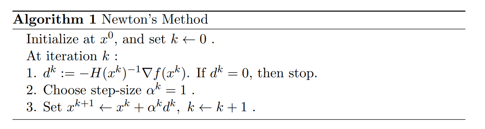
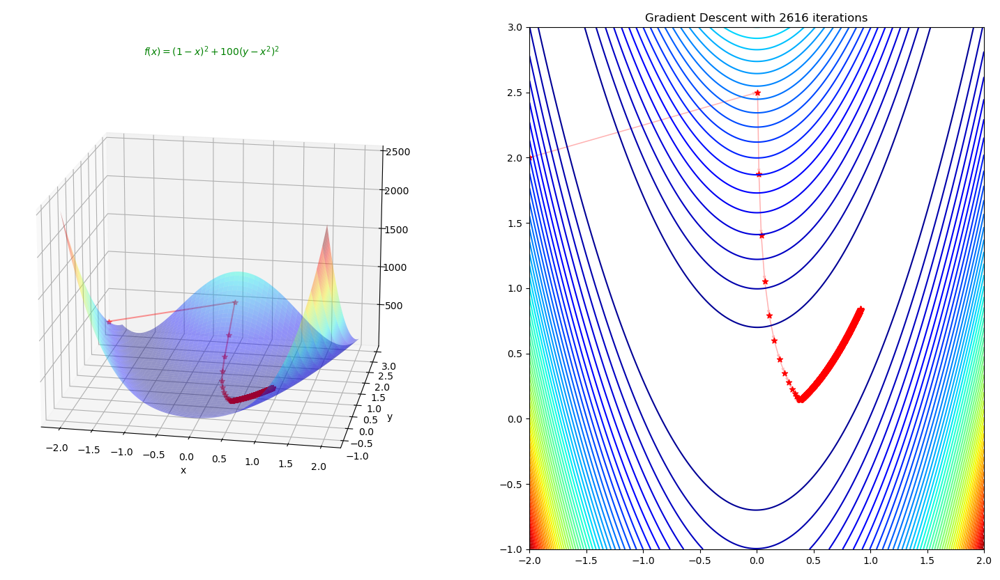
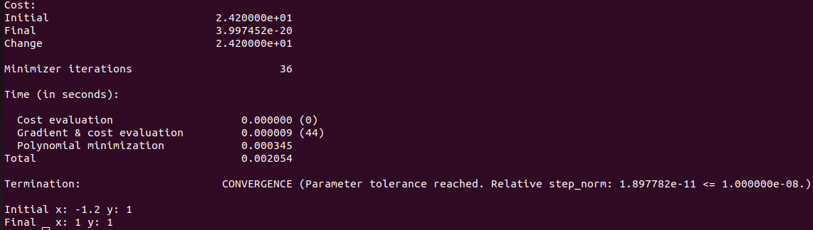

<center> <font size=8 color=green>牛顿法解RosenBrock函数最小值问题</font></center>

quandy2020@126.com

## 1 Rosenbrock函数

* Rosenbrock function

$$
f(x, y) = (a - x)^2 + b(y - x^2)
$$

​     其中全局最小值$(x, y) = (a, a^2)$, 当$a = 1, b = 100$
$$
f(x, y) = (1 - x)^2 + 100(y - x^2)
$$
​    优化问题：
$$
argmin f(x)
$$

* **Gradient**
  $$
  \nabla {f} = 
      \begin{bmatrix}
  		-400xy + 400x^3 + 2x -2 \\
  		200y - 200x^2
      \end{bmatrix}
  $$
  
* **Hessian** 

$$
H =
	\begin{bmatrix}
		-400y + 1200x^2 + 2 &  -400x \\
		-400x &  200
    \end{bmatrix}
$$

## 2 Newton's method

梯度下降（或称最陡下降）是一种用于寻找函数最小值的一阶迭代优化算法。为了通过梯度下降找到函数的局部最小值，沿着当前点处函数梯度（或近似梯度）的负方向迈出一步。如果沿着梯度的正方向迈出一步，那么就是在逼近该函数的局部最大值；这个过程则被称为梯度上升。

这一方法基于这样的观察：如果一个多变量函数在某点的邻域内被定义并且可微，那么该函数在负梯度方向下降最快。由此可得，如果：
$$
x_{n+1} = x_n - \alpha \nabla F(x)
$$

* 梯度处处垂直于等高线。 
* 在每次线搜索后，新的梯度始终与先前的步进方向正交（对于任何线搜索都成立）。 
* 因此，迭代往往以非常低效的方式在山谷中蜿蜒前行。



## 3 Python code

* Rosenbrock function

  ```python
  def Rosenbrock(x,y):
      return (1 + x)**2 + 100*(y - x**2)**2
  ```

* Rosenbrock gradient

  ```python
  def Grad_Rosenbrock(x,y):
      g1 = -400*x*y + 400*x**3 + 2*x -2
      g2 = 200*y -200*x**2
      return np.array([g1,g2])
  ```

* Rosenbrock Hessian

  ```python
  def Hessian_Rosenbrock(x,y):
      h11 = -400*y + 1200*x**2 + 2
      h12 = -400 * x
      h21 = -400 * x
      h22 = 200
      return np.array([[h11,h12],[h21,h22]])
  ```

* Gradient Descent implementation

  ```python
  def GradientDescent(Grad,x,y, gamma = 0.00125, epsilon=0.0001, nMax = 10000 ):
      #Initialization
      i = 0
      iter_x, iter_y, iter_count = np.empty(0),np.empty(0), np.empty(0)
      error = 10
      X = np.array([x,y])
      
      #Looping as long as error is greater than epsilon
      while np.linalg.norm(error) > epsilon and i < nMax:
          i +=1
          iter_x = np.append(iter_x,x)
          iter_y = np.append(iter_y,y)
          iter_count = np.append(iter_count ,i)   
          #print(X) 
          
          X_prev = X
          X = X - gamma * Grad(x,y)
          error = X - X_prev
          x,y = X[0], X[1]
            
      print(X)
      return X, iter_x,iter_y, iter_count
  ```

  最优解：[0.91654302 0.83970004]

  

* Python完整代码

  ```python
  import matplotlib.pyplot as plt
  import numpy as np
  from mpl_toolkits import mplot3d
  
  # https://xavierbourretsicotte.github.io/Intro_optimization.html
  
  def Rosenbrock(x,y):
      return (1 + x)**2 + 100*(y - x**2)**2
  
  def GradRosenbrock(x,y):
      g1 = -400*x*y + 400*x**3 + 2*x -2
      g2 = 200*y -200*x**2
      return np.array([g1,g2])
  
  def HessianRosenbrock(x,y):
      h11 = -400*y + 1200*x**2 + 2
      h12 = -400 * x
      h21 = -400 * x
      h22 = 200
      return np.array([[h11,h12],[h21,h22]])
      
  def GradientDescent(Grad,x,y, gamma = 0.00125, epsilon=0.0001, nMax = 10000 ):
      #Initialization
      i = 0
      iter_x, iter_y, iter_count = np.empty(0),np.empty(0), np.empty(0)
      error = 10
      X = np.array([x,y])
      #Looping as long as error is greater than epsilon
      while np.linalg.norm(error) > epsilon and i < nMax:
          i +=1
          iter_x = np.append(iter_x,x)
          iter_y = np.append(iter_y,y)
          iter_count = np.append(iter_count ,i)    
          
          X_prev = X
          X = X - gamma * Grad(x,y)
          error = X - X_prev
          x,y = X[0], X[1]
      print(X)
      return X, iter_x,iter_y, iter_count
  
  def NewtonMethod():
      ## 1 Newton's Method
      root,iter_x,iter_y, iter_count = GradientDescent(GradRosenbrock,-2,2)
      x = np.linspace(-2,2,250)
      y = np.linspace(-1,3,250)
      X, Y = np.meshgrid(x, y)
      Z = Rosenbrock(X, Y)
  
      #Angles needed for quiver plot
      anglesx = iter_x[1:] - iter_x[:-1]
      anglesy = iter_y[1:] - iter_y[:-1]
      
      ## 2 Surface plot
      fig = plt.figure(figsize = (16,8))
      ax = fig.add_subplot(1, 2, 1, projection='3d')
      ax.plot_surface(X,Y,Z,rstride = 5, cstride = 5, cmap = 'jet', alpha = .4, edgecolor = 'none' )
      ax.plot(iter_x,iter_y, Rosenbrock(iter_x,iter_y),color = 'r', marker = '*', alpha = .4)
  
      ax.view_init(45, 280)
      ax.set_xlabel('x')
      ax.set_ylabel('y')
  
      ax.set_title(r"$f(x) = (1 - x)^2 + 100(y - x^2)^2$", c='g', horizontalalignment='center', fontsize=10)
  
      #Contour plot
      ax = fig.add_subplot(1, 2, 2)
      ax.contour(X,Y,Z, 50, cmap = 'jet')
      #Plotting the iterations and intermediate values
      ax.scatter(iter_x,iter_y,color = 'r', marker = '*')
      ax.quiver(iter_x[:-1], iter_y[:-1], anglesx, anglesy, scale_units = 'xy', angles = 'xy', scale = 1, color = 'r', alpha = .3)
      ax.set_title('Gradient Descent with {} iterations'.format(len(iter_count)))
      plt.show()
  
  def main():
      NewtonMethod()
  
  if __name__ == '__main__':
      main()
  ```
  

## 4 Ceres code

* Ceres Solver求解Rosenbrock函数极值

  ```c++
  // f(x,y) = (1-x)^2 + 100(y - x^2)^2;
  struct Rosenbrock {
    bool operator()(const double* parameters, double* cost) const {
      const double x = parameters[0];
      const double y = parameters[1];
      cost[0] = (1.0 - x) * (1.0 - x) + 100.0 * (y - x * x) * (y - x * x);
      return true;
    }
  
    static ceres::FirstOrderFunction* Create() {
      constexpr int kNumParameters = 2;
      return new ceres::NumericDiffFirstOrderFunction<Rosenbrock,
                                                      ceres::CENTRAL,
                                                      kNumParameters>(
          new Rosenbrock);
    }
  };
  ```

* C++完整代码

  ```C++
  #include "ceres/ceres.h"
  #include "glog/logging.h"
  
  // f(x,y) = (1-x)^2 + 100(y - x^2)^2;
  struct Rosenbrock {
    bool operator()(const double* parameters, double* cost) const {
      const double x = parameters[0];
      const double y = parameters[1];
      cost[0] = (1.0 - x) * (1.0 - x) + 100.0 * (y - x * x) * (y - x * x);
      return true;
    }
  
    static ceres::FirstOrderFunction* Create() {
      constexpr int kNumParameters = 2;
      return new ceres::NumericDiffFirstOrderFunction<Rosenbrock,
                                                      ceres::CENTRAL,
                                                      kNumParameters>(
          new Rosenbrock);
    }
  };
  
  int main(int argc, char** argv) {
    google::InitGoogleLogging(argv[0]);
  
    double parameters[2] = {-1.2, 1.0};
  
    ceres::GradientProblemSolver::Options options;
    options.minimizer_progress_to_stdout = true;
  
    ceres::GradientProblemSolver::Summary summary;
    ceres::GradientProblem problem(Rosenbrock::Create());
    ceres::Solve(options, problem, parameters, &summary);
  
    std::cout << summary.FullReport() << "\n";
    std::cout << "Initial x: " << -1.2 << " y: " << 1.0 << "\n";
    std::cout << "Final   x: " << parameters[0] << " y: " << parameters[1]
              << "\n";
    return 0;
  }
  ```

  