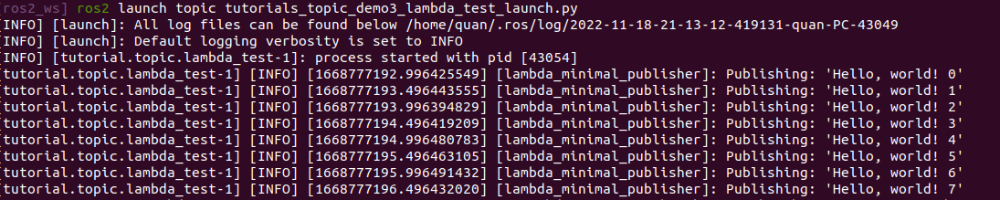

<center>  <font size=10 color='green'> ros2_tutorials —— topic使用 </font></center>

# 1 tutorial 1(initial_env_test)

## 1.1 功能介绍

> 环境搭建，打印一句话

## 1.2 代码

**头文件tutorials_topic_demo1_initial_env.hpp**

```c++
#include <chrono>
#include <memory>
#include <string>

#include "rclcpp/rclcpp.hpp"
#include "std_msgs/msg/string.hpp"


namespace ros2_tutorials
{
namespace topic
{

class EmptyNode : public rclcpp::Node
{
public:
    EmptyNode();
    ~EmptyNode();
};

}  // namespace topic
}  // namespace ros2_tutorials
```

**tutorials_topic_demo1_initial_env.cpp**

```cpp
#include "topic/tutorials_topic_demo1_initial_env.hpp"

namespace ros2_tutorials
{
namespace topic
{

EmptyNode::EmptyNode()
: Node("empty")
{
    RCLCPP_INFO(get_logger(), "Creating empty node.");
}

EmptyNode::~EmptyNode()
{
}

}  // namespace topic
}  // namespace ros2_tutorials
```

**测试文件tutorials_topic_demo1_initial_env_test.cpp**

```cpp
#include "topic/tutorials_topic_demo1_initial_env.hpp"

int main(int argc, char ** argv)
{
  rclcpp::init(argc, argv);
  auto empty_node = std::make_shared<ros2_tutorials::topic::EmptyNode>();
  rclcpp::spin(empty_node);
  rclcpp::shutdown();
  return 0;
}

```

## 1.3 编译

```perl
colcon build  --packages-up-to topic
```

## 1.4 运行

source环境变量

```shell
source install/setup.zsh
```

方式1

```shell
cd install/topic/lib/topic/
./tutorial.topic.initial_env_test
```

方式2

```shell
ros2 launch topic tutorials_topic_demo1_initial_env_test_launch.py
```

## 1.5 运行结果


# 2 tutorial 2(member_function_test)

## 2.1  功能介绍

> 创建一个消息发布者，每隔500ms发布一次消息“'Hello, world!”

## 2.2 代码

**头文件**tutorials_topic_demo2_member_function.hpp

```c++
class MinimalPublisher : public rclcpp::Node
{
public:
    MinimalPublisher();
    ~MinimalPublisher();

private:
    void HandleTimerCallback();
    rclcpp::TimerBase::SharedPtr timer_;
    rclcpp::Publisher<std_msgs::msg::String>::SharedPtr publisher_;
    size_t count_;
};
```

**源文件tutorials_topic_demo2_member_function.cpp**

```cpp
MinimalPublisher::MinimalPublisher()
: Node("minimal_publisher"), count_(0)
{
    publisher_ = this->create_publisher<std_msgs::msg::String>("topic", 10);
    timer_ = this->create_wall_timer(
        500ms, std::bind(&MinimalPublisher::HandleTimerCallback, this));
}

MinimalPublisher::~MinimalPublisher()
{
}

void MinimalPublisher::HandleTimerCallback()
{
    auto message = std_msgs::msg::String();
    message.data = "Hello, world! " + std::to_string(count_++);
    RCLCPP_INFO(this->get_logger(), "Publishing: '%s'", message.data.c_str());
    publisher_->publish(message);
}
```

**测试文件tutorials_topic_demo2_member_function_test.cpp**

```cpp
#include "topic/tutorials_topic_demo2_member_function.hpp"

int main(int argc, char ** argv)
{
  rclcpp::init(argc, argv);
  auto publisher_node = std::make_shared<ros2_tutorials::topic::MinimalPublisher>();
  rclcpp::spin(publisher_node);
  rclcpp::shutdown();
  return 0;
}
```

## 2.3 编译

```perl
colcon build  --packages-up-to topic
```

## 2.4 运行

source环境变量

```shell
source install/setup.zsh
```

方式1

```shell
cd install/topic/lib/topic/
./tutorial.topic.tutorial.topic.member_function_test
```

方式2

```shell
ros2 launch topic tutorials_topic_demo2_member_function_test_launch.py
```

## 2.5 运行结果


# 3 tutorial 3(lambda_test)

## 3.1  功能介绍

> 创建一个消息发布者（处理函数是lambda表达式），每隔500ms发布一次消息“'Hello, world!”

## 3.2 代码

**头文件**tutorials_topic_demo3_lambda_test.hpp

```c++
class MinimalPublisherWithLambda : public rclcpp::Node
{
public:
  MinimalPublisherWithLambda();

private:
  rclcpp::TimerBase::SharedPtr timer_;
  rclcpp::Publisher<std_msgs::msg::String>::SharedPtr publisher_;
  size_t count_;
};
```

**源文件tutorials_topic_demo3_lambda_test.cpp**

```cpp
MinimalPublisherWithLambda::MinimalPublisherWithLambda()
 : Node("lambda_minimal_publisher"), count_(0)
{
    publisher_ = this->create_publisher<std_msgs::msg::String>("topic", 10);
    auto timer_callback = [this]() -> void {
            auto message = std_msgs::msg::String();
            message.data = "Hello, world! " + std::to_string(this->count_++);
            RCLCPP_INFO(this->get_logger(), "Publishing: '%s'", message.data.c_str());
            this->publisher_->publish(message);
        };
    timer_ = this->create_wall_timer(500ms, timer_callback);
}
```

**测试文件tutorials_topic_demo3_lambda_test.cpp**

```cpp
#include "topic/tutorials_topic_demo3_lambda.hpp"

int main(int argc, char ** argv)
{
  rclcpp::init(argc, argv);
  auto empty_node = std::make_shared<ros2_tutorials::topic::MinimalPublisherWithLambda>();
  rclcpp::spin(empty_node);
  rclcpp::shutdown();
  return 0;
}
```

## 3.3 编译

```perl
colcon build  --packages-up-to topic
```

## 3.4 运行

source环境变量

```shell
source install/setup.zsh
```

方式1

```shell
cd install/topic/lib/topic/
./tutorial.topic.tutorial.topic.lambda_test
```

方式2

```shell
ros2 launch topic tutorials_topic_demo3_lambda_test_launch.py
```

## 3.5 运行结果


# 4 tutorial 3(lambda_test)

## 4.1  功能介绍

> 创建一个消息发布者（处理函数是lambda表达式），每隔500ms发布一次消息“'Hello, world!”

## 4.2 代码

**测试文件tutorials_topic_demo4_not_composable_test.cpp**

```cpp
#include <chrono>
#include <string>

#include "rclcpp/rclcpp.hpp"
#include "std_msgs/msg/string.hpp"

using namespace std::chrono_literals;

/* We do not recommend this style anymore, because composition of multiple
 * nodes in the same executable is not possible. Please see one of the subclass
 * examples for the "new" recommended styles. This example is only included
 * for completeness because it is similar to "classic" standalone ROS nodes. 
 */
int main(int argc, char * argv[])
{
  rclcpp::init(argc, argv);
  auto node = rclcpp::Node::make_shared("not_composable_minimal_publisher");
  auto publisher = node->create_publisher<std_msgs::msg::String>("topic", 10);
  std_msgs::msg::String message;
  auto publish_count = 0;
  rclcpp::WallRate loop_rate(500ms);

  while (rclcpp::ok()) {
    message.data = "Hello, world! " + std::to_string(publish_count++);
    RCLCPP_INFO(node->get_logger(), "Publishing: '%s'", message.data.c_str());
    try {
      publisher->publish(message);
      rclcpp::spin_some(node);
    } catch (const rclcpp::exceptions::RCLError & e) {
      RCLCPP_ERROR(
        node->get_logger(),
        "unexpectedly failed with %s",
        e.what());
    }
    loop_rate.sleep();
  }
  rclcpp::shutdown();
  return 0;
}
```

## 4.3 编译

```perl
colcon build  --packages-up-to topic
```

## 4.4 运行

source环境变量

```shell
source install/setup.zsh
```

方式1

```shell
cd install/topic/lib/topic/
./tutorial.topic.tutorial.topic.not_composable_test
```

方式2

```shell
ros2 launch topic tutorials.topic.demo4_not_composable_test.launch.py
```

## 4.5 运行结果



